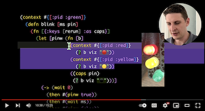

# 🌱 [open practice](https://www.youtube.com/watch?v=MJzV0CX0q8o)
a.k.a. **NEW COMMIT EVERY MINUTE**

<a href="https://www.youtube.com/watch?v=ehR-KIgw7T8" target="_blank">
  
</a>

STATUS: **Highly experimental.** (have fun following along if you want.)

<br>

_"So I'm trying to incubate a personal dynamic..."_ nah

<br>

I
just want to to **look inside** a function or variable and **see the data**

and tell **that machine** over there to **keep running this piece of code**.

<br>

_that's basically it. how hard could it be?_


<br>

_(is this now the worst piece of code on this githubs?)_

### TODO

- [ ] needs a better todo
  - [ ] because i feel blocked, or don't know where to start?
    - [x] _it's okay to relax for some time_
  - [ ] i should probably start over
  - [ ] what's the simplest thing to build on a day?
     - [ ] define portable editor text rewriting api?
     - [ ] decide how to txfer caps over network?
     - [ ] daydream some more interactions
       - [ ] what code should run where, and when (environments like dev/prod/staging but also cross-env access?)
       - [ ] how to persist & distribute code (something something hash)
    - [ ] or should it be "just" a library after all to be added into existing clj(s) projects?
- [ ] make it nice
  - [ ] no im doing it wrong again, just share (s)crappy fiddles
- [ ] can it be done in [<26 loc](https://buttondown.com/tensegritics-curiosities/archive/writing-the-worst-datalog-ever-in-26loc/)? just see data inline and run fns somewhere?
- [ ] make it secure enough to run my website
- [ ] blog post: dream clojure notes (see below)
- [ ] upload slides (+ text?) of presentations


<details>
<summary>

### DONE

</summary>

(newest first)

- [x] taking a break until 2024-11-01
- [x] demo it at LIVE@SPLASH & talk to fellow humans
- [x] **CURRENT** get this thing working well enough to give a fun presentation in 5 days.
- [x] upload codebases as-is (except check gitignore before)
- [x] add [gary bernhardt talk "a whole new world"](https://www.destroyallsoftware.com/talks/a-whole-new-world) to related work. **it is sooo good and nobody has seen it**
- [x] share [live 2024 submission reviews](2024-08-16-live2024-reviews.md)
- [x] share huge [raw notes](#raw-notes) file

</details>

- `2024-11-02 23:18` so many communities to check out, but now i'm just consuming even more rabbit holes all day. there's a fiddle to be scrapped
- `2024-11-02 23:18` live was fun and next time i'll make sure to stay longer for the bonus unconfs
- `2024-10-20 20:43` i hope the demo will work tomorrow
- `2024-10-15 18:34` still so so so fun!
- `2024-10-12 15:35` writing live like this is so so so fun


## Scratchpad (what i'm writing now)

i think this is what i'll try next: a simple clj(s) library to include in a _real world_ clj(s) project but that gives me _easy and simple_ repl access into production nodes, web clients etc.

keeping the central mqtt broker, so no port forwarding needed. keeping random IDs for nodes.

the big unknown is how to handle the code base being "out of band" (ie files, githubs etc) and thus out of sync vs what's loaded in process.

i think i _do_ want to keep code in files (for now? eventually maybe bidirectional sync between fs and some db?), searching across files, scrolling, goto-anything, jump to definition is great and all.

i need this library somewhat urgently to debug a weird timeout bug in a real customer project (some crypto thing, not proud, but it pays the bills for now)

they say you should build what you need, and use it. let's go


#### "prodhack"

that's the name

`nbb core.cljs` works

can we do it in a single namespace? (sure!)

so it should connect to some mqtt broker

but is there something more secure, like where channels are cap tokens?

maybe mqtt is overkill and it's not nice to use from bb. plain websockets?

i like the idea of json over websockets. (instead of edn over mqtt) how about json over anything? ssh? via json-over-file: edit a file as your local repl, watch process reads+evals, maybe writes back the result.

and don't do any funky encoding like trying to stuff tagged literals or ":keys" into json, just parse with :keywordize-keys. might just as well accept json and edn. put in json, get out json. put in edn, get out edn?

edn < json
mqtt < ws

(i'd want this thing to be as open-world as possible, and as simple as possible. less concepts, less moving parts. is json simpler than edn?)

(stop bikeshedding transport details)


### [🐣 Toots](https://clj.social/@albertzak) hatchery


`'()`


## Raw notes [20,000+ words]

From 2020-09 until 2024-08 I got paid to daydream (🚮). This is all I have to show for it.

I collected random interesting internet finds and a few own ideas in Apple Notes. Order is somewhat chronological, newest at the top. Sadly only very few entries are timestamped or properly sourced. Lightly edited (typos, clarity, formatting) and small parts translated from German.

**WARNING: very chaotic.**  i guess this is how my adhd brain works? anyways, *welcome traveler!*

|    | Legend |
| --- | --- |
|  🕺  | [my advisor](https://i4c.at/goeschka/) (btw he was awesome: just let me do anything, or nothing, no academic 🚮) |
|  🧼  | shower thoughts / own ideas (they get better from bottom to top) |
|  🎙️  | talks i've given |
| **bold** | this is the good stuff (i think) |

---


🧼 instead of adding syntax like the `!` before a (top level) expression to redeploy on every change inside, why not make it part of the symbol: `(defn! live [] ...)`


---

🧼

what if switching the git branch switched the repl conns
  - master actually is prod all the time them
  - but then you cant compare or investigate differences between envs (as easily)
    - could still "global" maintain repl conns in secret/gitignored file
  - eventually will need bidirectional sync to file system somehow


---

2024-10-15

doing now: getting updated LIVE/SPLASH demo ready

instead of lcd serial output, demo ultrasonic serial input!

1) ardu -> usb -> rpi serial -> cap

2) rework state + history slides (more fun!)

3) eve attribution +brandon +?


add motifn, dreamberd


explain before during demo:

- how to connect node, specify caps
  - show after rpi is blinking first

- (explain clj `#_#_` map keyval comment syntax)


preempt reviewer Qs (from simple to deep)


- why lisp?
  - trivial to rewrite
    - though code isn't 100% data (whitespace, linebreaks, comments)

  - why inline?
    - navigate through the inlined data with the same motions as you're traversing your code.
      - semi-structural paredit feels great, there's no divide between data and code.

- why clojure?
  - plain printable data font and center.
  - programs are just data and function
    - a handful of immutable data structures
    - and mostly pure functions operating on them
  - all state is usually kept ONE place
    - state = identity = succession of values over time
      - immutable, inspectable, printable etc
    - except closures
  - hold on to intermediate steps of a computation, anywhere
    - look at anything. it won't change from under you. and it's serializable, copypasteable, stable basis for comparison etc


- caps and liveness
  - i do think caps are a great fit in these live systems
  - haven't seen this combination except maybe *genode sculpt?*
  - more generally for working inside stateful systems (OO in the large)
    - kay: "we made objects too small"
      - i agree. OO in the large is not only inevitable but feels reasonable to work with in a live system like this. reifying physical places!
        - (i'll keep representing everything in plain data tho, sorry alan)


deeper design challenges that remain:

getting rid of things?
  - deleting text may or may not carry the intent of stopping that
    - think unison scratchpad
  - or creation/deletion may take very long (weeks for offline nodes?)
    - dependencies, docker containers, etc
    - how to show in the editor what nodes run what code?
      - only if i want to see that, and then preferably in plain text as well
  - there is a dynamically bound fn to register a cleanup handler for a process
    - very manual, easy to forget
    - need a more general purpose clean up mechanism, `(finally ...)` ?


dynamically changing sets of ~things/nodes~:
  - anything that can't be put in the text ahead of time
  - web clients?
  - programmatically spawned processes?
    - that don't have a correspondence in text
  - how to look at them? stop them?
  - now: indirection via caps
  - future: maybe enhance the top level with imperative command syntax
    - `> restart` or `/fn blink` to replace with fn from db
    - see also sigils below

what's the identity of a piece of code, a defn?
  - should we give ids to every expr?
    - i tried to keep exprs-with-ids to a minimum.
  - what's the meaning of diff versions of "same" function running on diff nodes?
  - i kind of work around this by keeping change sets extremely small (eg try to  redeploy on every keystroke as often as possible)
    - but then how'd you do a large refactor?
  - it really needs some notion of environment contexts, like dev/staging/prod
  - and control over when and how and where code changes are applied / happen
    - sigils? single character (like the `!`) preceding (top level?) forms
      - they can simultaneously represent an "imperative action" because they're a single kepyress, as well as declaring the desired state for other nodes to catch up to async
      - because it's only one char, it's a way to (somewhat) cleanly add imperative semantics to plain text
      - eg.
        - "under construction `🚧(defn ...`"
          - intercepts calls, holds them pending, collects args to display in editor, and holds pendig until sigil is removed, the flushes with "new" version
        - "only on my test machine"
        - "intercept/stub side effects" and use these handlers instead
      - may not have to be single character, if we can clearly know when it's added and removed
        - maybe autocomplete of all sigils in scope helps?
        - btw do not be temped to treat multi char sigil as one inline-block
          - need to keep copypasteability, and ability to cheaply toggle sigil by eg removing last character only
            - or toggle between 2+ valid sigils with common prefix: `aaa` `aa` `aaaa` (just delete or add chars)
            - the fastest way to a/b test?
      - heavily domain dependent, only need to provide a way to `(defsigil 🚧 [...])`


---


MUMPS!

db+code in one global persistent structure, available on every node

crazy 1966 system still in use today

http://www.cs.uni.edu/~okane/index.html

"Global has a different meaning in this language than in most; such variables are global across routines, processes, and sessions. Thus, editing a global variable is making permanent and immediate changes to a system-universal database (which survives reboots, etc.)"

https://en.wikipedia.org/wiki/Cach%C3%A9_ObjectScript


"I worked in MUMPS (the language Cache evolved from) for several years in the early nineties and am now in the Java world.  Although I don't miss the language itself much (except from a sick, twisted sense of nostalgia), I do miss some of its features.

The thing I miss most about it is the hierarchical database backing it.  What takes multiple tables and cross-ref tables in a relational database can be done inside a single database structure (called a Global) in MUMPS.  Also, it is trivial (and runtime fast) to create any number of indices into a Global by putting your indexed data into the hierarchical keys.  So data search and retrieval can be incredibly fast and efficient.

Another nice feature is the intimate relationship between the language and the database.  First, variables are also hierarchical and can contain data in the keys.  This means that you never have to write a sort - simply setting Var("DEF") = 1 and Var("ABC") = 2 will give you data sorted on the keys.  Second, you can set entire database structures into local memory with one operation.  Suppose you have a database record ^PATIENT("Data", 12345) and you want to fetch it.  You say SET PATIENT = ^PATIENT("Data", 12345), and now the PATIENT local variable contains the entire record.  No Object/Relational Mapping necessary."

rob freundlich https://what.thedailywtf.com/post/38414

https://what.thedailywtf.com/topic/508/intersystems-cach-233-gateway-to-hell/20

" Then there is the database, which clearly sucks based on the programming language. There's no way to see the tables (it's a class, which doesn't make sense, because the idea behind a table is that it represents a single object, not a collection of objects. The data is the collection of objects. Then there's this Obj(ect)Id that I guess is what the damn tables should really be indexed on, but its a "imaginary" field the same way Sqrt(-1) is an imaginary number. So you have these tables, that you can't really see, and you have data, which is like no where. No way to access it. It's the ultimate system for holding data captive. THERE IS NO ESCAPE for your data."

drakhelm


---

Glisp - wow! bidirectional ui+code, bound via clj metadata or type-wrapping fns

looks like clojure, but it's not, it's implemented in typescript via MAL (make-a-lisp)

`(fn {})` lovely map destructuring args -- i wish clojure had that

https://glisp.app/commit:e7fbaae/?code_url=

https://scrapbox.io/glisp/%E3%83%A6%E3%83%BC%E3%82%B6%E3%83%BC%E5%AE%9A%E7%BE%A9%E3%82%B7%E3%82%A7%E3%82%A4%E3%83%97

https://scrapbox.io/glisp/Glisp_v2:_Why_strong_type%3F

"Unlike conventional language, the types in Glisp is more like a metadata that stores informations for GUI"

https://scrapbox.io/glisp/Inverse_Evaluation

https://github.com/baku89/glisp/tree/main/docs

https://mit.zoom.us/rec/play/TibuQ8H2Bp1_8x7lPtl68MDoFTUttLuLx20RnUyff20wsRFPUFp8OS8dtbwzEU40KcIlOIqPizZoLXyz.Lpkw0-g0XsMoyBKp?canPlayFromShare=true&from=share_recording_detail&startTime=1621440014000&componentName=rec-play&originRequestUrl=https%3A%2F%2Fmit.zoom.us%2Frec%2Fshare%2FH9FyRt_JDjFh2UognOBr3AuGeHts3f128d5vlUuJ64JuX5_7aJA_OkA0jD2DjK0t.VN86tdpeSPH7FIjP%3FstartTime%3D1621440014000


### January 2024

🧼 IDEAS

decouple fn name from fn definition. name != id.

"programming with petnames"

"like google docs share link to edit, but section-wise" (for any function, or any tiny subexpression)

just early explorations about the interactions

ausdrücke mit IDs markieren: (readable :r342ew ...) | writable | custom
macro: expose | read | write | ID | editable | readable | share | release | publish | access | open | changeable | capify

**"delegate authority to change a part of the system by changing a part of the system in plain text"**

**filtering "glasses"**

CAP SHARING WORKFLOW

editor: click cap link, adds to editor; or drop, or paste cap in > line.

mix multiple projects in one editor

```
> cap://acme.co#proj:31232 [enter]
(u/defn petname-for-that-cap [] ...)
```


WHAT DOES A CAP LINK CONTAIN?

the id, duh. but maybe also: location? suggested name?

`cap://acme.co/#suggestion:opas-fn;cjrf290qewja`

custom protocol or http link that then

universal link: https://developer.apple.com/documentation/xcode/allowing-apps-and-websites-to-link-to-your-content

can simply support both: interchangeable protocol `ocap://` and universal link via domain


FUNCTION DEFINITIONS

`u/defn`: separate name from rest

defines fn under hash of current code

and defines a petname (updated?) that points to the newest id.

maybe: u/defn rewrites symbols in body to be deref'd late with `#'`

EXTERNAL RESOURCES

btw: how to add external resource

dragdrop int editor

saves hashed in ipfs-like cas, turns in to a cap string in text.

this solves external resouce problem, makes it super open world

(note from sept 2024: this is like realtalk refs work!)

---


Clojure var names (symbols) you're allowed to use: `$ % ! ? & >> << !! && | => _ -- `

---

Is it really "Complex"? Or did we just make it "Complicated"?

https://youtu.be/ubaX1Smg6pY?t=4326

```
Object: :needs [a b]  :produces [x y]
Object: :needs [b u]  :produces [a]
```

Kay: an **OO system in which messages are only RECEIVED** (something to think about)

Kay: Sending msgs is the problem; who are you gonna send them to?

Kay: **Ship the design (the "what": constraints, meanings**...., not the "how")


---

common lisp like condition system in clojure

https://github.com/clojureman/special + related works

https://github.com/bwo/conditions


---


Quokka/Wallaby

Our plans for 2024

As we step into 2024, our focus remains steadfast on enhancing the ergonomics and user experience of our development tools. Over the years, we've witnessed significant advancements in the UI capabilities of various editors, particularly in VS Code. Recognizing these developments, our goal for 2024 is to elevate how we present and display information beyond code coverage indicators, inline values/errors, and Code Lens. Beginning with Wallaby for VS Code, we're looking to rework/improve the following areas:

- Test Execution Progress
- Wallaby/Quokka Consoles
- Test Results
- Runtime Values
- Logs & Errors
- Test/Code Stories
- Value Explorer
- Output Inspector
- Time Travel Debugger
- We envision transforming the output window from its current form, which often involves navigating multiple panes and simplistic text views, into a rich, interactive experience. This will provide context-sensitive information, tailored to the specific file and line of code that you're working on. The new UX will not only offer helpful suggestions but also a more intuitive and efficient way to interact with our tools.


---

https://news.ycombinator.com/item?id=13455811

2. Folks in the CS and programming world seem to ignore bleeding edge work being done in the arts space. To get a broader view of languages than "characters that go into a plain text file", expose yourself to the live-ness of the following -

2.a Max/MSP/Jitter - by David Zicrelli and Millet Pickette's - Visual data flow programming language with decades of dominance in the Computer Music scene.

2.b SuperCollider - for architecture lessons as well as another multi-paradigm language.

2.c Impromptu - a Scheme based live coding environment for music and visuals by Andrew Sorenson. Normal REPLs will bow in front of most "live coding" languages used for music.

2.d Ixilang by Thor Magnusson - another live coding language, where the language is in a sense inseparable from its run time environment. The current running behaviour of a textual program could also depend on how the program evolved.


---

**Above all else, show the data. -- Edward Tufte (via Bret?)**

---


biff

Biff is designed so that **as much as possible, changes take effect immediately without needing to restart the system (through the use of late binding)**.

Biff is designed to give you strong defaults while still allowing you to change just about anything without too much hassle. The goal is that Biff **helps you to launch quickly and it doesn't get in the way later** on as your needs evolve.

Biff doesn't need to add much frontend architecture thanks to htmx. htmx allows server-side frameworks like Django, Rails, and Biff to to be used for moderately interactive apps, while still keeping most of your code on the backend.


---

jepsen history task

https://github.com/jepsen-io/history/blob/521d9b85a6d3ff72bc6af0c364e745839dfeeda5/src/jepsen/history/task.clj

**Tasks either run to completion or are cancelled; they are never interrupted. -- If they are, who knows what could happen?**

"Unlike standard j.u.c executors, tasks in this system may be created,
queried, and cancelled *transactionally*. The executor's state (`State`) is a
persistent, immutable structure. You perform a transaction with `(txn!
executor (fn [state] ...))`, which returns a new state. Any transformations
you apply to the state take place atomically."


---

aphyr salticid <3

Salticid is not a cloud deployment system, though you could dynamically create hosts to make it into one. As presented here, **it's designed for fixed sets of nodes**. We used it at Showyou and Vodpod to manage ~30 physical nodes in two datacenters.
Salticid has no central control of deployment. **There is no server or locking. There is nothing to install. All you need is SSH. Anyone with credentials can use it, which makes it ideal for scenarios when you don't have control over the entire infrastructure but still need to automate some tasks.** We had a small team and kept our config in a git repo, and added a ruby check to verify the repo was up to date before running any commands. All is anarchy.
This is not a config management tool. It has no notion of convergence or scheduled checks, and can't tell you when things are out of sync with a target. **On the other hand, it runs at interactive latencies and tells you what went wrong immediately, so you may find keeping systems up to date is easier with Salticid.** I strongly recommend writing idempotent tasks so you can just re-run them whenever you make a change or want to confirm everything is in order.

https://github.com/aphyr/salticid


---


🧼 idea: val.town but via email:

  - lisp repl as email service
  - send code/fns/defs/schedule
  - receive acks/data/scheduled
  - build systems by email? wtf dunno


---

dave ackley <3

**efficiency and robutness are at odds over redundancy - which robustness requires - and efficiency - eliminates**

that's what it means to be efficient

we think that the alternative to efficiency is waste

but there is another choice: robustness
"somebody else doing it too, just in case"

need to get past the idea that correctness and efficiency are all that matters

**embrace diversity, fallibility, open-ended scalability w fundamentally improved securability**

**best-effort computing**

cpu-ram-ram-ram-ram-ram-ram-ram-ram-ram-ram-ram-ram-ram-ram-ram-ram-ram-ram-ram-ram-ram

ram = identity functiuon

cpu = tinpot dictator


old ackley work: http://keys.ccrcentral.net/ccr/text/jargo-blast.html


---

🧼 IDEA: clj-quick

main contribution: **just textual programming ui for seeing values + interacting by text**

principle: "worse is better" (vs e.g. oz)


- in scope:
  - install q/fns on one or more remote nodes
  - see q/fns installed on nodes (lifecycle: under construction, fake-queue)
  - see q/fn calls, timestamp, args and return values in text
- tradeoffs:
  - for backoffice apps with one central server.
  - organizational trust assumed
    - all clients generate a unique id, need to be known to server (though may register)
  - close-enough clock synchronization between all nodes assumed
    - global order for shared facts imposed by single central server
  - no special handling of network or node failures, flow control, determinism, ordering, consistency semantics
- incidental:
  - multitier programming, deployment as a concern of the language
  - maybe compile dataflow dag to nodes' code (probably hard, let the electric people figure it out kthxbye)
- no:
  - secure code sharing
  - package mgmt


Open Qs:

- ? processes are stable identities (they have an id that serves as capability token)
- ? should they nest deeply and form a supervision tree?
- ? or should they be flat namespaced in the node db (and accessible via cap id?)


`(? ...)` and `(?? ...)` forms signal interest for matching nodes/pids to best-effort publish some data to the server. they MAY follow this request.


- `!` sends the form to the evaluator,
  - which is a process on the central server that gives ids, installs into the global db...
  - -> this is a process that can be inspected, changed, paused
    - just liken anything else in the system
      - is this a good idea?
        - if the eval proc is broken, there's no way to fix the system
          - maybe its ok after all, we can just install the prev vsn of the proc handler


---

dc-res abstract talk

2023-06-02

🎙️ Can Programs be User Interfaces for Databases?

Freeform interactive s-expressions via edit-time macros

Traditionally, code is considered a one way input to the machine, with minimal feedback to the programmer. This talk aims to enhance freeform text editing by cherry-picking interaction patterns from structural editing, treating parts of the program as a user interface to the state of the (distributed) system.

Introducing basic composable single-character "sigils" that have an immediate effect on nearby expressions as soon as they are typed allows for instant evaluation or querying the live value of some state, drawing inspiration from interaction patterns found in Lisp REPLs (read-evaluate-print-loop).

A general mechanism for defining inline editor macros is presented. These "emacros" run at edit time, have access to the state of the running system, and are capable of modifying their plain text representation, e.g. in response to some state change or programmer interaction. It is shown that they can be used to construct various affordances that live within the program as it's being worked on.


*(below my words, then fed to chatgpt, above edited by me again)*


🎙️ Can Programs be User Interfaces for Databases?

Freeform interactive s-expressions via edit-time macros


programmers interact with stateful and stateless structures through plain text
most programmers don't want to miss the affordances of plaintext (copy-pasteable, temporatily allows invalid syntax, etc -- see graydon hoare's "always bet on text") - strict structural editing remains small niche because they generally remain cumbersome to use.

code is usually seen as a one-way batch-like input to a machine, a (possibly very abstracted) list of instructions to carry out. the computer generally does not use the same medium to "talk back" to the programmer. machine output may appear in a log (semi-structured, usually not directly consumable by the program itself), a debugger (information remains locked inside complex UIs) or just by observation. lisp repls displaying evaluation results inline unobtrusive editor hints, autocompletion, are interaction patterns that have found success in bringing some affordances to plaintext editing for shortening the edit-save-recompile-restart-check-loop without getting in the way.

between free-form text editing and strict structural editing lies a spectrum, we can borrow ideas from semi-structural plain text editing interfaces like emacs org-mode, TaskTXT, Soulver

This talk introduces some ideas around treating the freeform program an a (programmer's) user interface to the running (distributed) program, especially its state. basically extending lisp repl semantics with more structure, control over immediacy, and over the entire running system (as opposed to the usual 1:1 editor-progam repl connection)

First, some expressions like state definitions get persistent unique IDs right inside the code (eg as seen in Capt'n'Proto, somewhat also like in Unison).

Second, basic composable single-character "sigils" that, as soon as they are typed, have an immediate effect on the expression they are near, such as instant evaluation (!) or querying the live value of some state (?).

Third, a general mechanism of defining inline editor macros with the program, which are capable of modifying their plain text representation in response to some state change or user interaction. It is shown that they can be used to construct various affordances that live within the program as it's being built.


--------------

🎙️ Live demonstration of a novel interactive programming environment (early prototype)


This is a demonstration of the current state of the proposed programming environment that allows constructing and interacting with a distributed application on the fly, without restarting, losing state, or the need for imperative deployment. Its immutable database and capability security primitives provide an environment amenable to exploration and modification.

Code and data together with changes to both are represented as fully normalized atomic entity-attribute-value (EAV) facts.
A single global writer accretes these facts as reified transactions in an immutable log together with timestamps and provenance metadata.

Side effects are controlled via the object capability model; and capability tokens are used for node identity and group membership.

The editing environment is comprised of any typical text editor writing plain s-expressions (Clojure data literal forms) to a scratch file; a file watcher reading the forms as assertions and retractions of facts to transact; and a viewer component for data visualization running in a web browser next to the editor.

An early prototype was implemented in less than 600 lines of Clojure (so far; excluding dependencies) and can be used to show the feasibility of building a simple distributed application on top of it.

Immediate future work includes supporting forward declarations, function namespacing, keeping named state out of closures, and handling exceptions.


---

https://ocsigen.org/eliom/latest/manual/clientserver-react

http://mozart2.org/mozart-v1/doc-1.4.0/dstutorial/index.html

https://scala-loci.github.io/

unison

**Electric Clojure is unique in that we hyperfocus on the use case of practical web development (targeting a local maxima in utility) rather than trying to maximize the global abstraction power. ("Worse is better")**


---

leo noel

missionary

discrete time: streams = succession of similar events, requires backpressure (all evts need to be processed in order)  (mouse clicks, log entries, db transactions) - only exists at time of event
continous time: signal = the state of an entity, requires lazy sampling (mouse position, clock time, db state (why?) spreadsheet cells (why? - they are always defined, can take an immutable snapshot at a point in time, can also watch them. derived computations are also continuous signals)

- it's about backpressure vs lazy sampling.
  - in CT you get lazy sampling,
  - in DT you get backpressure.

```
(what?) (one) (many)
data: values | sequences
effects: task | flow
```

  - tasks are effects that produce one value
  - flows are effects that produce multiple values


- functional effect and streaming system
  - you can use CT and DT with both effects (dual and complementary)
  - many effect systems are either CT or DT, but you'd want both since some effects are inherently discrete or continuous and they have different requirements
  - language extension, alternative to monads


---


https://merveilles.town/@nakst/110904552263386432?utm_source=substack&utm_medium=email

(via omar rizwan folk newsletter)

@nakst@merveilles.town

"everything is a file"

**applications can dynamically register global, stateless APIs that are inspectable by the end-user and accessible from any programming language**

[running] applications can [as root] dynamically register [with some work] global, stateless APIs [either str foo() or void foo(str bar)] that are inspectable by the end-user [but confusable with real files] and accessible from any programming language [but awkward to use in e.g. C because of the text parsing, or gathering events]

Aug 17, 2023 at 12:46

@nakst

It's noteworthy how while typical APIs have data types like int, bool and string, **filesystem-based APIs have data types like text, images and others that can be dynamically registered** by applications.
I also think it would be **cool if there were ".bool" and ".int" files, and when you open them you get a window with a lone checkbox or slider** respectively.


---

what i want is basically console ninja in prod

https://github.com/wallabyjs/console-ninja/tree/main#logpoints

---

### April 2023

🧼 IDEA: **sigils**

dynamic scope **wrapping forms wrapped and topform-eval'd by a single character stroke**

definable inline (maybe)

(note from 2024) yes! the bang is a sigil per this definition because it _does_ something the moment you type it out to the (top level) form right after it. the dynamic scoping part is not important.


🧼 IDEA: multi repl over mqtt

- one topic per "object"
  - **inspired by alan kays "every object should have an url/ip address"**
   - topic name is a capability token
- node listens to its (root?) cap token channel


🧼 IDEA: repl sections in plaintext ui delimited by `--`
  - evaluation results go on empty lines between section delimiters


🧼 IDEA: Plain text UI for EAV forms, inspired by imp

```
; create/upsert entity by id
#"entityid"34a12fd893e4da1"
:person/first-name "Joe"
:person/last-name "Erl"

; update existing entity by query
[:= :person/last-name "Patsch"]
:access/banned true

; create entity with new random id
; editor would need to fill new id
```


🧼 IDEA: unison + clojure - bloat = nij

- lisp, clojure data literals,
- same namespaces: no mutable globals
- transactional reified changes to the whole codebase


---


mech lang by cmontella from eve

https://www.hytradboi.com/2022/i-tried-rubbing-a-database-on-a-robot

<33333


---

https://github.com/davidbullado/blog/blob/main/we-need-a-new-versioning-notation.md

Ending Dependency Chaos: A Proposal for Comprehensive Function Versioning

```
@moduleVersion 2
 ...
@funcVersion 16
export function addFunction(a: number, b: number): string {
  return a + b;
}
```

hmmm dunno

---

<3

https://xtdb.com/blog/trucks-tubes-truth/

Differentiate into categories:

- Commands
  - "passive-aggressive events"
  - **if an event implies anything at all will happen when it is read, it isn’t an event**
- Application/Domain Events
  - CQRS-like, eg. FundsTransferred
- System Event
  - aka change data capture CDC
  - opaque computational observations ("accountUpdated")
- document events
  - pure stateful observations, a declaration of state at a point in time, RESTful event-carried state transfer


---

from the epic Future of Coding log by Steve Krouse

https://futureofcoding.org/log

"steve krouse OS"

"From my chat with JE [Jonathan Edwards] I realized I've been secretly dreaming of a dataflow OS, not a strictly Conal-DCTP-one. [Conal Elliott's Denotational Continuous Time Programming, what FRP should have meant]. Architecture feels a lot like CycleJS actually

"It’s more related to algebraic effect handlers, which I think Conal would say are like monads in that they import the imperitive way of thinking into FP instead of building better abstractions on top"

"**Programming is setting up computation over time.** Unfortunately this means that many important **insights about your program aren't apparent until future times**  Live programming is about **bringing insights from future times to the time of programming**"

"I've actually been asking for a definition of "programming" that is better than "telling a computer what to do" and now I like "telling what a computer what it should do later""

Eric Green New Deal Now Gade @ecgade


**"How many language features can be replaced with editor ones? (stub outline)**

  - lets, closures, imports (Cyrus Omar of Hazel talks about this)
  - it seems like most things can be editor features, especially if the editor is recognizing patterns and making syntactic sugar out of them (a la lamdu)
  - it’s the things you want in the AST (stored as metadata) that maybe should be in the language semantics?
"


"Show the (inner) data (and it’s structure/type). BV says it best, “Some people believe that spreadsheets are popular because of their two-dimensional grid, but that’s a minor factor. Spreadsheets rule **because they show the data**.... If you are serious about creating a programming environment for learning, the number one thing you can do – more important than live coding or [ … or … or … ] or anything else – is to **show the data**.”"

"But despite these shortcoming’s spreadsheets succeed because of the above discussed adherence to “**show the data**” as well as embodying what I would argue is the second most important programming environment characteristic: create by reacting, which is distinct from by is enabled by live coding."

"But again, to be clear, I want to focus on **show the data as my only focus first, and maybe after that’s mostly done, I’ll see if I can slip in a create by reacting.** (The jury is still out on whether live coding is absolutely require. My gut says it is, but I don’t want to make the mistake again of thinking more things than are necessary are necessary.)"

"Another key insight: **the default behavior of FRP applications should be to persist data for forever unless programmed otherwise. The resetting of app’s data on page reload is a wacky accident!**"


---

https://rxmarbles.com/#max

https://rxviz.com

https://rxfiddle.net

---

eli parra

homoiconic spreadsheets + clojure

  - "code is evaluated data"
  - "data is quoted code"

since 2018, excel and sheets have a literal representation of cells as text, aka dynamic arrays (as opposed to static/autofilled ones)
```
a1 b1
a2 b2 ===
usually by rows === {a1, b1; a2, b2}
can be by cols === {{a1; a2}, {b1, b2}}
comma , next column (like csv)
semicolon ; next row (like sentences, like newline)
```

  - (can only create NxM tables, must be rectangle)
  - BUT they break the fundamental value rule of spreadsheets (a cell can only effect its own value) by spilling over right and bottom cells.
    - (excel required an entire rewrite of its formula engine)
  - in practice, it only bends the rules. array spills need space (empty cells) - if the cells contain a value, the ={} expression is an error and no values are filled


---

<3 deno

https://matklad.github.io/2023/02/12/a-love-letter-to-deno.html

---

jamie again

https://www.scattered-thoughts.net/log/0021/

**EVERY TOP LEVEL DEF HAS AN ID hash23412321**

After taking a step back and thinking about the problem from scratch I had an epiphany - **why is there even a database? If you have a declarative language which can describe data and computation, why use that to compute an imperative action to apply to a totally different system for describing the same data. This is implementation driven thinking.**

Let's just mutate the source code instead.

The history of the program lives in a sqlite database. You can use the cli tools to spit out the current version of the program into a text file, edit it in a text editor and then commit the diff back into the database.

```
#2280651848495541
parent("Bob", "Charlie").

#3378495017200132
ancestor(x, z) <-
  parent(x, y),
  ancestor(y, z).

#3531648068531767
ancestor(x, y) <-
  parent(x, y).
```


---

expressions of change:

- change as language primitive, design a formalization,
- reify modifications in the program
- custom editor+pl

i'm not sold on the approach, seems abandoned.

haha comment from audience: it's just catamorphism+anamorphism (speaker asks to get explanation later)


---

jamie 0020


Fossil

Fossil is the one of the few local-first apps I know that is actually used in anger. It started out as just a DVCS but over time grew a wiki, issue tracker, forum and various other embedded apps. All of which run offline and can be pushed/pulled between repos and even forked.
So I was curious to find out how it worked under the hood.
The underlying data-structure is content-addressed append-only set of artefacts. Forum threads, wiki pages, issues etc are built by summing up the effects of special event artefacts.
Forums are effectively OR-sets - all you can do to a post once it has been made is delete it, leaving a tombstone in the tree.
Wiki pages do last-write-wins. I expected to at least get a merge conflict, but no.
Issues are bags of key-value pairs, where each pair does last-write-wins.
In one sense, it's disappointing that there is so little handling of conflicts.
But on the other hand, there is very little handling of conflicts and it seems like it's fine in practice. So maybe many problems can fall to being broken down into atomic facts and doing last-write-wins for each fact?

+

Self-hosting

https://www.scattered-thoughts.net/log/0020/


I lurked in various discussions of self-hosting recently. One point that seemed rarely challenged is that self-hosting is hard.

That has been my experience for many pieces of software. But self-hosting fossil is really easy.

What makes most software hard to self-host?
  - **Too many moving pieces**
  - **Too many configs to learn**
  - Non-trivial backup and restore

What makes fossil easy to self-host?
  - Single executable
  - Builtin web server (fossil serve)
  - Single file database (easy backup and recovery)
  - Sync to other devices (your local working copy of a fossil repo is also a backup)
  - Config stored in the database
  - Config edited by builtin web interface (fossil ui)

Other things we could add:
  - Automatic updates
      - Notifies me first if update requires more than a few seconds downtime, manual action (eg migration) or might break something. (Notifying people is often the part I'm most worried about breaking and is often hard to configure eg synapse wants a separate email gateway set up. But fossil will talk directly to fastmail for me.)
  - **Self-check**
      - Notify me if not reachable from the internet
      - Notify me if running out of disk space
  - Simplified hosting
      - Give them a binary and a database, they run it (and restart it if necessary)
      - **Notify me about crashes/restarts**
      - Ship a minimal OS that does nothing but run my binary
      - Deal with OS upgrades (shouldn't cause problems if not depending on dynamic libraries, userland services etc)
  - **Put a console/repl in the web interface so I can do bulk edits (eg banning users)**

Why isn't this more common? I suspect because most software is optimized for **industrial use, not personal use.** For industrial uses the operations overhead is not a big deal compared to the development and operational efficiency gained by breaking things up into communicating services. **But for personal uses the overwhelming priority is reducing complexity so that nothing fails.**


---

fosdem2022

The relational model in the modern development age. Schema migrations suck. The state of the art has barely changed since the first SQL databases. Vitess has put a ton of effort into fixing this. (?)

---

jamie on instrospecing async

I'm still thinking about this async gui pattern.

If I convert code that uses explicit state machines to use async/await then it's easier to read, easier to write, and I can use defer to manage lifetimes. But I can no longer just print out the state, or make debugging tools that tell me eg which users have requests that are currently waiting on database io. **Are there any implementations of async that let you inspect the closed-over state of awaited futures/promises/frames?**

---

from jamie 0021:

Typed Image-based Programming with Structure Editing.

Dealing with type/schema migration by recording changes to types in a structural editor and using an OT-like process to reconcile conflicts. I'm not sold on this approach - it spends a lot of complexity dealing with changes to anonymous product types, but given that you're editing in a structural editor already there is no need for anonymous product types - **just insert ids under the hood.** But I think the paper is still valuable for elucidating the problem. **Version control of code and schema migration of persistent data are clearly two facets of the same problem but our current tools treat them as entirely separate domains.**


---

ideas from subtext 10 design doc:

user mode (can only change data, value types must stay fixed, limited errors possible) vs programmer mode (can change functions, more errors possible)

function run forwards are pure, ref transparent etc; but when run backwards, they have imperative effects: user can edit the output, which feeds backwards through the fn to change inputs.

fns are defined with concrete values that serve as examples of their types

Subtext has no syntax for describing types: it only talks about values. Function inputs are defined with a default value, so no type needs be specified. Likewise error messages never talk about types — instead they point to a mismatch between values at two code locations, additionally referencing the code locations where they were defined.

We believe that type systems are an essential formalism for language theoreticians and designers, but that many language users would prefer to obtain their benefits without having to know about them and write about them.

_FIXME: simpler: names are nominal, everything else is structural. Field names can be nominal because we can bind them contextually, even in constructors, because of argument defaults. _
In PL theory terms, Subtext mixes aspects of structural and nominal type systems. It is structural in that x = array{0} and y = array{1} have the same type. It is nominal in that x = record {a: 0} and y = record {a: 0} have different types. Every time a block item is defined a globally unique ID is assigned to it. There is a workspace-wide dictionary that maps these item IDs to their current names. Renaming a block item just changes that dictionary entry. Type equality requires that block item IDs be equal, not that their names are currently spelled the same.


---


https://twitter.com/Mappletons/status/1561357946960990213

Mini apps and bits of software you’ve built just for yourself and/or friends and family.

Things that don’t scale, aren’t meant for others to use, & valuable just for your specific, snowflake use case.

---

on headers <3

**open-ended metadata, "allow all, bless some"** (clj maps philosophy <3)

https://subconscious.substack.com/p/if-headers-did-not-exist-it-would

"We really do build entire apps just to tag files with a bit of metadata.
Way back in 1990, BeOS took this insight and ran with it. Files in BeOS could be tagged with any key-value metadata you liked. The metadata could be displayed as columns in the file finder."

In fact, many BeOS "apps" were really just finder windows with specific metadata columns. You could customize or create your own "apps" by modifying the columns in a window.


---

pitfalls of edn

https://nitor.com/en/articles/pitfalls-and-bumps-clojures-extensible-data-notation-edn


---

jamie brandon again, imp/preimp

imp live repl, evals whole buffer on every keystroke

language co-design needed to give semantics to partial programs without structural editing

(cut buffer in half, evaluate up to cursor point is still a valid expression)

has only tiny fixes like auto closing parens

brandon proposes: reify watches.

select expression to watch, hit key to reify as (expression34241),

then compare with other watch expr


**🧼 IDEA: reify watches by sigil/edwards-probe, give id**


---

jamie brandon again

the program is the database is the interface

https://www.scattered-thoughts.net/writing/the-program-is-the-database-is-the-interface

**OOOOH MY MIND IS BLOWN, THIS IS THE _LITERAL_ "self modifying code" INTERACTION MODEL I WAWS DREAMING ABOUT**

https://www.scattered-thoughts.net/log/0022

Continuing with the 'the program is the database' theme from last month, I made a clojurescript dialect (called preimp) where **the only source of mutable state is the source code itself**. It works well enough for spreadsheet-sized datasets:


jamie data soup problems

https://www.scattered-thoughts.net/log/0020#data-soup

**"my computer usage is full of tiny CRUD problems that are typically solved either with single-purpose apps or with adhoc manual effort. Here's a random selection off the top of my head:**


---


jamie brandon (eve, logicblox, hytradboi...) <3

https://www.scattered-thoughts.net/writing/the-shape-of-data/ <3

- handles are the better pointers
  - Another way to think about it is that a pointer combines an id with the context for interpreting that id. The id 42 is just a number, but the pointer 42 is something we can dereference to find out what it refers to.
  - At some point we have to interpret ids, so we have to have pointers or something like them for providing context. But there are hefty advantages to restricting our application-level data model to be a tree and using ids to model the graph-like parts.


refset response on reddit:

There are plenty of good insights in there, so it's worth a proper skim, but I'd summarise it for this audience as "This is not a blog post about Clojure, **however Clojure+edn gets a tonne of things very right compared with most languages and is really only missing the-codebase-is-data and the-execution-is-data**". There are explanations of these concepts plus a wishlist towards the end.


**Initiatives that I suspect can help Clojure's ecosystem greatly on those two fronts...**
  1. **Durable, transactional REPL**: https://github.com/repl-acement/repl-acement (explanation here https://github.com/repl-acement/editors)
  2. UI toolkits: https://github.com/HumbleUI/HumbleUI and https://github.com/phronmophobic/membrane
  3. **Alternative runtime paradigms**: https://github.com/babashka/sci and https://github.com/Convex-Dev/convex (not Clojure...but close enough)
  4. (any others to suggest?)


---

  - omniscient debugger (can access multiple points in time simultaneously)
  - time travel debugging (can move forward/backwards)
  - robert o callahan
  - chromometer=amber
  - rr = for c/c++
  - pernosco


  - how time travel debuggers work:
    - a: state snapshots (git -- actually not, noone does this in practice but its only the presented logical model)
    - b: change tracking (sun, amber, odb? -- usually mixed with periodic snapshots)
    - c: deterministic replay (rr, panda)

robert: [on connecting debuggers to a running system] **if your program is actually 100s of processes running on 100s of machines in the cloud, you don't know which one to atttach to ahead of time**, and if you stop it, you kind of break the whole system [...] so these things have to keep running -> record and replay is a better fit.


  1. debugging has been trending on a downward spiral:
  2. **infrastructure doesn't even support attaching debuggers (anymore)**
  3. people don't use debuggers anymore, whatever language/tooling support there was kind of rots away
  4. fall back to log debugging
  5. eventually people come to assume that dedicated debug tools don't work, can't work


---

eve dev diary http://incidentacomplexity.com/archive/

<3

---

certain details in the way it is usually applied only work with compiled languages and, when applied to interpreted languages, result in the trivialization of theory noted by Wand's classic paper, "The Theory of Fexprs is Trivial".

Mitchell Wand. The Theory of Fexprs is Trivial. Lisp and Symbolic Computation, 10:189--199, 1998.
Abstract: We provide a very simple model of a reflective facility based on the pure lambda-calculus, and we show that its theory of contextual equivalence is trivial: two terms in the language are contextually equivalent iff they are alpha-congruent.

ummmmmmmm


---

peter saxton

https://petersaxton.uk/log/

typed structural editor, hot code reloading, built on gleam = (erlang, js)

actor primitives, config is code (client random id) for cluster mgmt

effect types

<3

---

DC-RES Conf 23

http://www.wikicfp.com/cfp/

(ACM SAC 23 closed)

IEEE COMPSAC - Symposium on Computer Architecture & Platforms (CAP) Track == 31 jan

IEEE ICSE, DS == 1 Feb

ACM SIGOPS HOTOS, USA, RI https://sigops.org/s/conferences/hotos/2023/index.html == 2 Feb

ACM+IEEE SIGOPS ASE, LUX, Kirchberg https://conf.researchr.org/track/ase-2023/ase-2023-tool-demonstrations Tool Demonstration == 28 Feb++

IEEE ICDCS Demo &Poster session, Hong Kong https://icdcs2023.icdcs.org/call-for-demo-and-posters/ == 6 April

ACM SIGOPS / USENIX SOSP Symposium on Operating Systems Principles, DE, Koblenz https://sosp2023.mpi-sws.org/index.html == 10 April

ACM SPLASH/OOPSLA/DBPL/DLS/Onward/LIVE PT,  == 14 April

~ IEEE SECDEV Atlanta, GA, USA https://secdev.ieee.org/2023/home Conf oct 18~23


---

Show HN: We built a developer-first open-source Zapier alternative (trigger.dev)

https://www.reddit.com/r/ProgrammingLanguages/comments/10gylhm/are_there_any_languages_with_transactions_as_a/


https://flora.sourceforge.net/aboutTR.html

Flora-2, an object oriented logic language, has first-class support for transaction logic


---

Paper ideas 2023-01-16
Survey: Side-by-side Code/REPL state visualization tools/approaches: REPLugger, Clerk, Proto REPL

---

🕺 help advisor i don't want to write

Hi Michael,

The tinkering is coming along pretty well, but I'm starting to feel a bit uncomfortable because I just can't seem to get into writing. Do you have any ideas on whether/how some of this could be packaged as a smaller paper?

**Identity of top-level definitions** More theoretical: what are the tradeoffs when functions (or other top-level definitions) are identified either by hash or by unique ID? In reality, both forms are rare; most often, only the name exists anyway. What hybrid forms make sense and when?
Hash: Unison; Unique ID: cap'n'proto, homeassistant

**Survey of the previous versions of Eve** The Eve project has apparently produced 34 completely different programming environments. Besides a GitHub repo, there isn't much information about it—so this would be more of an archaeology study, one I'd rather read than write.

**Pause execution on exceptions, inspect bindings, resume with new code—without support from continuations** A poor approximation of Smalltalk's "does not understand" or Common Lisp's condition system, except that it does without continuations in the host runtime, using only indirection+promises at every function call.
But it doesn't really work reliably, is a weird hack, only works for simple code without closures/callbacks, "poisons" call sites with promises, and inspecting or modifying the call stack will never work (only local bindings). And updating/resuming doesn't work yet either.
I'd be too embarrassed to publish it at the moment—maybe when it's more useful and together with a workflow/editor integration, or at least "distilled" API primitives.

**Editor integration via language server protocol** I can now finally show simple autocomplete, hover tooltips, and read-only text over top-level definitions.
Essentially, custom mini-editor UIs that are defined inline with the code.
It's probably still too early to settle on a specific workflow or built-ins, but these small UI additions are already quite helpful, for example, when editing an existing function.
Todo: refine the API, find more use cases, abstract recurring usage patterns.
I find it promising and interesting but don't yet see a paper in it.

**Current test project for the system:** live reading of my electricity/gas consumption.

**The Good** working with real data right away: tapping the IR port via serial, ring buffer code, message header/length/footer parsing, AES decryption, byte offsets/bytes to int, and even live writing to MQTT and debugging was incredibly fun. I rarely had so much flow while programming, all without waiting for compile/restart.

**The Bad** it still needs much more editor support and more interactivity in the editor itself; at the moment, the editor is just input, and the viewer window is just output—that's "too far apart." I also still had to restart often and lost state, but that wasn't too bad here.

**The Ugly** single-writer EAVT as a "one data model to rule them all" is nonsense, at least in direct use (i.e., everything is global). It clearly needs normal primitive state containers (atom) and also implicit local state in closures. State in atoms can be mapped well to EAVT; but closures (equivalent to object instances) not at all. Dynamic software update of function instances/objects is probably the biggest unsolved question mark in this field for the last 60 years (yes CLOS but no); I hope to handle it well enough with the other tools, like "if the system has to restart or crash, then that's okay too."

Or something from the completely untouched construction sites from our last conversation? Surface syntax, namespacing, when-then production rules, data constraints -- Since there's nothing really new here, probably only in combination with the rest.

Thanks ✨


---

a few programming language features i'd like to see

https://neilmadden.blog/2023/01/18/a-few-programming-language-features-id-like-to-see/

teleo-reactive programs

```
to make_tea:
  when perfect(tea) -> done
  when brewed(tea) -> remove_teabag; add_milk
  when hot(water) -> pour_into(cup); add_teabag
  when cold(water) and full(kettle) -> boil_kettle
  when empty(kettle) -> fill(kettle)
```

+ design by contract

```
to make_tea:
  achieves full_of(cup, tea)
  requires not empty(tea_box)
```


+ STRIPS planner

```
achieve full_of(cup, tea)
```


---

c.a.r. hoare's turing speech 1980

the emperors new clothes

The first principle was security: The principle that every syntactically incorrect program should be rejected by the compiler and that every syntactically correct program should give a result or an error message that was predictable and comprehensible in terms of the source language program itself. Thus no core dumps should ever be necessary. It was logically impossible for any source language program to cause the computer to run wild, either at compile time or at run time. **A consequence of this principle is that every occurrence of every subscript of every subscripted variable was on every occasion checked at run time against both the upper and the lower declared bounds of the array.** Many years later we asked our customers whether they wished us to provide an option to switch off these checks in the interests of efficiency on production runs. Unanimously, they urged us not to - they already knew how frequently subscript errors occur on production runs where failure to detect them could be disastrous. **I note with fear and horror that even in 1980, language designers and users have not learned this lesson. In any respectable branch of engineering, failure to observe such elementary precautions would have long been against the law.**


The story of the Mariner space rocket to Venus, lost because of the lack of compulsory declarations in FORTRAN, was not to be published until later.

The way to shorten programs is to use procedures, not to omit vital declarative information.

At last, there breezed into my office the most senior manager of all, a general manager of our parent company, Andrew St. Johnston. I was surprised that he had even heard of me. "You know what went wrong?" he shouted - he always shouted - "You let your programmers do things which you yourself do not understand." I stared in astonishment. He was obviously out of touch with present day realities. How could one person ever understand the whole of a modern software product like the Elliott 503 Mark II software system?

I realized later that he was absolutely right; he had diagnosed the true cause of the problem and he had planted the seed of its later solution.

[granger adds in "against the current": this is basically incompatible with open source software]

I gave desperate warnings against the obscurity, the complexity, and overambition of the new design, but my warnings went unheeded. I conclude that there are two ways of constructing a software design: One way is to make it so simple that there are obviously no deficiencies and the other way is to make it so complicated that there are no obvious deficiencies.

But to me, each revision of the document simply showed how far the initial Flevel implementation had progressed. Those parts of the language that were not yet implemented were still described in free-flowing flowery prose giving promise of unaltoyed delight. In the parts that had been implemented, the flowers had withered; they were choked by an undergrowth of explanatory footnotes, placing arbitrary and unpleasant restrictions on the use of each feature and loading upon a programmer the responsibility for controlling the complex and unexpected side-effects and interaction effects with all the other features of the language.


---

granger: "a really fast db is still a really slow programming language"

we (eve) could put 2,000 balls on the screen (at 60 fps), rust could do 4,000,000

over the course of the eve project they built
  - 34 programming environments
  - 24 compilers
  - 16 storage engines
  - 9 interpreters
  - dozens of parsers and standard libraries


eve bibliography

https://github.com/witheve/eve-experiments/blob/master/design/bibliography.md

https://www.cl.cam.ac.uk/~afb21/publications/HCC02a.pdf

Makes a strong argument that programming is inherently non-direct


---

Abraham Coetzee's Masters thesis

"Combining reverse debugging and live programming towards visual thinking in computer programming"

The thesis is full of great insights and gives a great summary of other work.

algojammer + related work
https://github.com/ChrisKnott/Algojammer


---
http://glench.com/NonprogrammersPaper/

glench redesign of

Studying the Language and Structure in Non-Programmers' Solutions to Programming Problems by Pane, Ratanamahatana, and Myers


--

protorepl: save macro takes a unique identifier (y not containing fn name) and recognizes local binding values


Glench: REPLugger temporary overrides of values, fake into if statements, save and name overrides to edit them also if we're in a different part of the code -- maybe unnecess w scratch namespacing only pulling together relevant fns


---

http://worrydream.com/MagicInk/#interactivity_considered_harmful


That is, this software is normally "used" by simply looking at it, with no interaction whatsoever. In contradiction to the premise of interaction design, this software is at its best when acting non-interactively.

Accordingly, all interactive mechanisms—the buttons and bookmarks list—are hidden when the mouse pointer is outside the widget. Unless the user deliberately wants to interact with it, the widget appears as a pure information graphic with no manipulative clutter. (Tufte uses the term "administrative debris.")


Generality. If we think of a computer as a machine that runs software, then in some sense, all data handled by a computer platform must be "software." The data making up a JPEG image, for example, can be thought of as the encoding of a program that describes a picture. (This is sometimes called the "data is code" equivalence.) But the limitations of the JPEG platform result in severely lobotomized "programs"—they cannot animate, respond to context, incorporate new compression techniques, or otherwise take any advantage of the computer beyond what JPEG explicitly allows. A crippled platform cripples a designer's means of expression.


In order for a designer to take full advantage of the medium, a good platform must provide safe access to everything that is technologically possible. A platform for information software must offer: inputs from the environment (that is, communication with other software and physical sensors), from history (that is, storage), and from the user (that is, interaction); computational resources with which to respond to inputs; and unrestricted graphical output. Anything less robs information software of its full potential. The proper way to prevent destructive behavior is a well-designed security model, not arbitrarily amputating the computer's capabilities.


**"The platform must make it possible to create information software. The tool must make it easy"**


---

Beautiful Software

Christopher Alexander's research initiative on computing and the environment

"...the character of the computer environment of the future needs to become more childish,
and more human, if it is to help human beings to genuinely extract the best of themselves...
this change may well affect activities which are apparently technical, not only those that one
broadly classifies as 'creative'."

In the future we'll only understand how to build good software,
if we focus, now, on creating software that does good ...

"It is a view of programming as the natural genetic infrastructure of a living world which
you/we are capable of creating, managing, making available, and which could then have the result
that a living structure in our towns, houses, work places, cities, becomes an attainable thing.
That would be remarkable. It would turn the world around, and make living structure the norm once again,
throughout society, and make the world worth living in again." -- Christopher Alexander

https://beautiful.software


---

https://worrydream.com/SeeingSpaces/

bret victor

seeing spaces

you need to be able to:
1. see inside
2. see across time
3. see across possibilities

---

🧼 demo agenda

slides: take problem tree from scaling the repl experience (2021-09-09)

- cljs devtool file writing client
- cljs devtool browser / visualization reading thing
- cljs runtime / server
- cljs runtime / client node tool

editor interactions:

- write db query form, save,
- forms get id if they don't already have one
- results get written in next form (append after current top level)
- write fn -> save -> fn gets installed

show:

- bootstrap node with cap key
- hello world blinky
- server has full access to db
- clients can transact via server
  - (but still have a local only db, which they may post parts fo to the server for debugging if requested by a data item)
- paused exceptions: programmer workflow to resolve by transacting data
- server has tx database, shares all data to all clients.
- editor is a client that can query data, send txs to main server


### November 2022

🧼 I HAVE A FEELING INTERACTIVE PROGRAMMING IS A GREAT FIT FOR CAPABILITY SYSTEMS

- how to interact with capabilities in an interactive programming system?
  - create
  - attenuate
  - delegate

- scope: JUST rosalind-like line of business apps,
  - one central master controller with full authority,
  - many dumb clients
  - and some special devices
    - (sms, imaging, scanners, door locks, leds, sensors)
    - few named known snowflake pet servers
  - <1000 users
  - NOT mutually suspicious parties (packages, signatures, pubkeys)
  - NOT end user programming (customize, control caps of device)


---

🧼 INTERACTON STYLE IDEA: PAUSED LIVE EXCEPTIONS

  - What's the programmer's workflow?
    - Don't unwind the stack
      - but give user the opportunity to unwind to known-good stack location (refresh ui)
  - + ui to attach user messages
    - "chat with programmer"
      - what I was doing,
      - programmer asking for clarifications
      - user responding while their app gets fixed
    - subsumes github issues
      - support chat no longer living in a separate infra
        - through this has obvious drawbacks re stability


  - Pause at exception site
   - until "live" programmer fixes the issue
     - usually within a few minutes

  - Similar to Smalltalk's didNotUnderstand message
    - or Dark's 404
  - the programmer looks at live exceptions
    - the system groups similar errors (like Sentry)
      - but shows CL-like unwind-protect debugger
      - and call data inline with callee code


  - this also elegantly "solves" hanging closures error
    - and errors when hot upgrades would have failed
    - instead of failing, they just hang with all open closures
     - + data/state visible to the programmer
       - can edit data; can replace code; can resume or abort

Editor UI ideas for lexical wrapping / define "blast membranes"

```
(local ...)
(node # { aaa }  ...)
(temp ...) - retracted when deleted
(??) -simulate side effects
```

---

🧼 paper idea: CLOJURESCRIPT ON SES (or even better within Jessie subset of SES?)

https://es.discourse.group/t/what-is-the-current-status-of-ses-tinyses-and-jessie/1306/10

  - seems like jessie, jessica, ses, are abandoned
  - hardnened js moniker is stale
    - can we really just use sci?
      - how can the js world not produce a cap safe subset in 20 years
        - but borkdude can?
          - while building maintaining 20 other hard core libs?
            - 🧠

---

paula gearon - not your mother's datalog

https://www.youtube.com/watch?v=Ug__63h_qm4

Datalog is not Predicate logic. (but looks like it is).

Graphs can be viewed as Predicate logic:

`predicate(node1, node2).`   - vs -    `[node1 predicate nodde2]`
`attribute(entity, value)`   - vs -    `[entity attribute value]`

(extrinsic data: what we put in) vs. (intrinsic data: generated by rule evaluation)

- is datomic datalog?
  - *yes*
   - has intrinsic database
   - has extrinsic database via rules
   - has rule recursion
   - has termination guarantee
   - has exensions (negation)
  - (however, the graph query language for datomic is a graph query language)
     - (it is not _the_ datalog language)


---

🧼 Redell's caretaker pattern in Clojure

```
(defn
  make-caretaker
  "Redell's caretaker pattern"
  [o]
  (let [ok? (atom true)
        o' (fn [& args]
             (if @atom
               (apply o args)
               (throw :unauthorized)))
        gate (fn [new-ok?] (reset! ok? new-ok?))]
    [o' gate]))


(defn main [{:keys [carol bob] :as sys}]
  (let [carol (:carol sys)
        [carol2 carol2gate] (make-caretaker carol)]
    ((:bob sys) carol2)
    (carol2gate false)))
```

---

🧼 thinking about a subset of clojure that is cap-safe, impl'd as a library within clojure

- rework namespace mechanism:
  - no more mutable map
  - require modules at runtime by hash
  - **requiring modules is a capability**

- open world:
  - just ocap safe subset of clojure
  - **inspectable atoms, defns**
  - code in global db
    - but fns may not access global db
      - unless given access


- **~ASSUME A SINGLE CENTRAL SERVER~**
  - and trusted clients
  - this is for **building personal scale software**
    - this simplifies everything
  - a place to store logs/defn-invokes/atom-changes
  - a serializer for global time


---

🧼 some ideas for possible self-contained papers

  - `deffn`
    - a wrapper for (could also monkeypatch core/defn - haha) top level functions, and saves anonymous closures under its top level entry ID (best effort match?)
    - definitions to give them IDs / track evolution of a single fn over time, and evolution of a namespace over time to save call/return data and perf metrics (and any other custom metrics defined inline) to display in editor **(using custom viz functions, also defined inline)**.
      - where to save/stream metrics to?
        - save locally in persistent fact db, that's all
        - data layer should take care to replicate this somewhere else

possible editor UI:

```
(deffn mimi []) ; full color when available in all

; missing from: prod-a _eval_
(deffn bar []) ; greyed out because it is not present in all connected(monitored) nodes' namespaces
```

  - `drop-in atom`: record state changes of nodes, stream back to editor, experiment with prod data

  - `Polajure`:
    - A POLA capability subset of clojure
    - like SES/Agoric/Jessie, **remove effectful fns from stdlib**
    - **hell i'd use that immediately**
      - hmm maybe **SCI already does that**
        - yep of course ❤️


---

what's the difference between edit/developer mode and user mode?
user mode: POLA is in effect, only given references are available in scope, effects happen (!)
dev mode: POLA is off, all refernces are visible to the dev, can look into any fn params/state/reconfigure code, effects are simulated (!)

in other words, master dev has a capability to see/change everything (an access cap to every fn defined by them)
another dev may have a capability to see [args/returns of] or change a particular function used in my system?

HOW to unify a global freely accessible db with ocap/POLA?
a. db reads are side effect free and unrestricted (if given the db as arg) - no cap needed except db value (and pure query fn)
b. local db simulations / ephemeral data overlay (with db db' ...) are free and unrestricted, again just db value and pure fn needed
c. persistent db writes to local vat/node - effectful cap needed (closure with bound swap!) (fn update! [new-db] (reset! db new-db)) or better because more confined: (fn append-tx! [tx] (swap! db d/apply-tx tx))

while a, b seem like no caps because they are just values (but give free access to db value), they are caps as well (?) - the read only cap to an value
it's just a static value. quote miller: "Data provides only irrevocable knowledge, so don't bother wrapping it (in a caretaker/membrane)"

"the right to exercise access carries with it the right to grant access". [capmyths, (Gong's citation [1] is Boebert's 1984 paper, which corresponds to our citation [2]).]


---

clerk

As top-level form to change the document defaults

Independently of what defaults are set via your ns form, you can use a top-level map as a marker to override the visibility settings for any forms following it.

Example: Code is hidden by default but you want to show code for all top-level forms after a certain point:

```
(ns visibility
  {:nextjournal.clerk/visibility {:code :hide}})

(+ 39 3) ;; code will be hidden
(range 25) ;; code will be hidden

{:nextjournal.clerk/visibility {:code :show}}

(range 500) ;; code will be visible
(rand-int 42) ;; code will be visible
```

This comes in quite handy for debugging too!


---

landau / eros/capros

http://www.charlielandau.com/EROS_Interface_Design.html

**Separate functionality from human interface.**

This principle seems obvious when you consider that it is easier to write a program to take a program-friendly interface and translate it into a human-friendly interface, than vice-versa, because the translator is a program not a human.

---

"Novel problems arise while fixing bugs in confined programs."

notes on debugging keykos http://cap-lore.com/CapTheory/KK/Debug.html

---

The Can Opener

Often some family of brands have no proprietary interests to protect from each other and we invented the can opener for such a family. A can opener will try to open a domain by invoking each domain creator whose brander is in the family. If it succeeds it instals a DDT and reports the real type of the opened object.
An unimplemented recent idea is to include creators outside the family. The opener recalls that such creators are not of the family and reports the type by numeric code, probably the alleged key type.

keykos / cap-lore

branding ~= nominal typing

family ~= (super-)class hierarchy ~= certificate chain


---

Perspective

Security and Privacy, and even reliability, rely on the inabilities of programs, not so much the abilities. Unix fails the capability test because **there are too many ways for programs to have effects, or receive information. Manuals list ways to do things. You don't find in manuals even claims such as "the above are all those ways".** A kernel programmer is usually pleased that he has provided a new way to move information around. I worry about the Mac's 115 kernel extensions.
Another observation is that connection begets connection; message may convey capabilities. More importantly: Only connection begets connection.


---

**The art of upgrade is to preserve state amid change and to enable change amid state. --with apologies to Alfred North Whitehead**

The original being "The art of progress is to preserve order amid change and to preserve change amid order." from Alfred North Whitehead in "Science and the Modern World", Macmillan, 1925 or 1929.
from http://erights.org/data/serial/jhu-paper/intro.html


---

Miller's thesis -- OMG related works

"**Global namespaces create intractable political problems.** Froomkin's Toward a Critical Theory of Cyberspace [Fro03] examines some of the politics surrounding ICANN. In a world using key-centric rather than name-centric systems, these intractable political problems would be replaced with tractable technical problems."

**"Data provides only irrevocable knowledge, so don't bother wrapping it (in a caretaker/membrane)"**

"Lauer and Needham's On the Duality of Operating System Structures [LN79] contrasts "message-oriented systems" with "procedure-oriented systems." Message-oriented systems consist of separate process, not sharing any memory, and communicating only by means of messages. The example model presented in their paper uses asynchronous messages. Procedure-oriented systems consist of concurrently executing processes with shared access to memory, using locking to exclude each other, in order to preserve the consistency of this memory. . The example model presented in their paper uses monitor locks [Hoa74]. Their "procedure-oriented systems" corresponds to the term "shared-state concurrency" as used by Roy and Haridi [RH04] and this dissertation."


OCaps: Small step from pure objects

+ Memory safety and encapsulation+ Effects only by using held references + No powerful references by default

(miller http://soft.vub.ac.be/events/mobicrant_talks/talk1_ocaps_js.pdf)

Dr. SES - Distributed Resilient Secure EcmaScript

Stretch reference graph between event loops & machine

Crypto analog of memory safety

**Unguessable URLs as Crypto-Caps**


---

Potluck

https://www.inkandswitch.com/potluck/

**"application state lives in the text"**

"no hidden metadata; searches are just a function of the text."

**structured personal micro-syntax**

**computational freeform text**

**results displayed in overlays (next/atop/over), text stays editable**

buttons edit text (and cause recomputation) - this avoids loops


"Text editors are generic and refined tools that have many built-in features like copy/paste and undo/redo. Having state directly in the text gives us these features for free. For example, you can copy a document to a different text editor to edit and then paste it back into Potluck, and it retains all of its behavior. By using text as the source of truth, Potluck inherits the affordances and powers of text.
Originally we tried allowing users to manually highlight entities in the text. We abandoned this approach mainly because manual highlighting was tedious, but also because it created hidden state outside the text that was hard to reason about."
"In some cases, our demos violate this general principle by storing ephemeral state which isn't stored in the text. For example, our default timer widget doesn't store the remaining time in the text, so a running timer won't survive a copy-paste. This wasn't a particularly principled decision though; in theory, any state that can be encoded as text can be stored in the document itself."

"The text-based todo list app TaskTXT has a good solution to storing timer state in the document. When a timer is started, it records the start time into the text document in a human-friendly format. The result is that even a running timer can survive a cut-paste."

---

Programming Portals

https://maggieappleton.com/programming-portals

"Small, scoped areas within a graphical interface that allow users to read and write simple programmes"


---

**Why we need lisp machines**

**A personal mind dump on operating systems**

https://fultonsramblings.substack.com/p/why-we-need-lisp-machines?r=1dlesj&s=w&utm_campaign=post&utm_medium=web

"UNIX was designed as a self-contained system. you simply didn't have other computers you would rely on. You had your department's computer, and you would sometimes send messages and files to their department computers. That's the full extent of UNIX's intended networking abilities."

"**A modern UNIX system isn't self-contained.** I have 4 UNIX systems on my desk (Desktop, laptop, iPhone, iPad) I'm contentiously using the cloud (iCloud for photos, GitHub for text files, Dropbox for everything else) to sync files between these machines. The **cloud is just a workaround for UNIX's self-contained nature**"

https://liam-on-linux.dreamwidth.org/80795.html


---

Hell Is Other REPLs: Being Mutable and Avoiding Bad Faith Programming

https://hyperthings.garden/posts/2021-06-20/hell-is-other-repls.html


---

Monte lang (python+ocaps)

https://monte.readthedocs.io/en/latest/intro.html

"While "arbitrary code execution" is a notorious security vulnerability, Monte enables the fearless yet powerful use of multi-party limited-trust mobile code."

---

emakers

Emakers have an important security property: they come to life contained in a world with no authority. Such a world is even more restrictive than the Java sandbox used for applets. However, this world is more flexible than the sandbox because authority can be granted and revoked during operation using capabilities


---

cap'n proto schema definitions

top level defns have random IDs


"A Cap'n Proto file must have a unique 64-bit ID, and each type and annotation defined therein may also have an ID. Use capnp id to generate a new ID randomly. ID specifications begin with @:"

```
@0xdbb9ad1f14bf0b36; # file id

struct Foo @0x8db435604d0d3723 {
  # ...
}

enum Bar @0xb400f69b5334aab3 {
  # ...
}
```

If you omit the ID for a type or annotation, one will be assigned automatically. This default ID is derived by taking the first 8 bytes of the MD5 hash of the parent scope's ID concatenated with the declaration's name (where the "parent scope" is the file for top-level declarations, or the outer type for nested declarations). You can see the automatically-generated IDs by "compiling" your file with the -ocapnp flag, which echos the schema back to the terminal annotated with extra information, e.g. capnp compile -ocapnp myschema.capnp. In general, you would only specify an explicit ID for a declaration if that declaration has been renamed or moved and you want the ID to stay the same for backwards-compatibility.


IDs exist to provide a relatively short yet unambiguous way to refer to a type or annotation from another context. They may be used for representing schemas, for tagging dynamically-typed fields, etc. Most languages prefer instead to define a symbolic global namespace e.g. full of "packages", but this would have some important disadvantages in the context of Cap'n Proto:

  - Programmers often feel the need to change symbolic names and organization in order to make their code cleaner, but the renamed code should still work with existing encoded data.

  - It's easy for symbolic names to collide, and these collisions could be hard to detect in a large distributed system with many different binaries using different versions of protocols.

  - Fully-qualified type names may be large and waste space when transmitted on the wire.

Note that IDs are 64-bit (actually, 63-bit, as the first bit is always 1). Random collisions are possible, but unlikely – there would have to be on the order of a billion types before this becomes a real concern. Collisions from misuse (e.g. copying an example without changing the ID) are much more likely.

Evolving Your Protocol

A protocol can be changed in the following ways without breaking backwards-compatibility, and without changing the canonical encoding of a message:

  - New types, constants, and aliases can be added anywhere, since they obviously don't affect the encoding of any existing type.
  - New fields, enumerants, and methods may be added to structs, enums, and interfaces, respectively, as long as each new member's number is larger than all previous members. Similarly, new fields may be added to existing groups and unions.
  - New parameters may be added to a method. The new parameters must be added to the end of the parameter list and must have default values.
  - Members can be re-arranged in the source code, so long as their numbers stay the same.
  - Any symbolic name can be changed, as long as the type ID / ordinal numbers stay the same.


---

on stupidity of performance over everything (1990)

To Editors, Communications of the ACM

Dear Sirs:

The paper, "An Empirical Study of the Reliability of Unix Utilities", by Miller, Fredriksen and So, in the December, 1990 issue of the Communications, provides extremely valuable empirical feedback on the state of the art in commercial software today. Unfortunately, the state that it exhibits is somewhat embarrassing, mostly because the programming errors discussed in the paper are the direct result of programming styles recommended by popular texts on C programming, and aided and abetted by today's RISC architectures.

Much more ominous is the current practise of demonstrating high speed on benchmarks with all run-time checks turned off. Because computer hardware (and sometimes software) is sold on the basis of execution speed, it is inevitable that every corner will be cut in achieving the maximum speed on these artificial benchmarks. The customer wants the same code that was benchmarked, so the code is delivered with all run-time checks disabled. Unfortunately, the costs of recovering from a disaster due to array-bounds or pointer violations usually far exceeds the savings from the slightly increased execution performance.

Some of these benchmarked systems are "mission-critical" embedded systems, in which bad programming style can kill people. The run-time checks generated automatically by Ada compilers are often turned off to gain a few additional percent in execution speed. Thus, rather than having the software discover its own errors in a benign way, the discovery of such errors is left to the FAA or a Congressional committee.

Software engineering has long stressed the need for defensive programming styles which constantly check for array bounds and null pointer violations (among other things), but because the C language does not provide for these checks to be automatically generated, programmers often leave them out. Furthermore, the code is "more elegant" when the checks are suppressed. This is a good example of a variation on Whorf's hypothesis, which states that language affects thinking; in the case of programming, the language used does affect the quality of the code produced.

Today's untagged RISC architectures put the burden on optimizing compilers to generate efficient run-time array-bounds and pointer checks. Unfortunately, on a serial architecture these additional checks do take additional time. While clever optimizing compilers can move many checks out of inner loops, the availability and quality of the average compiler leaves a lot to be desired. As a result, benchmarkers continue to find it productive to remove such run-time checks. Perhaps the new "superscaler" architectures capable of executing several instructions simultaneously will eliminate most of the cost of these run-time checks. The existence of such architectures will do nothing, however, to correct a whole generation of computer software which was written without these checks.

Engineers optimize what can be quantified; that is their job. Since execution performance is readily quantified, it is most often measured and optimized--even when increased performance is of marginal value; viz., the mandatory "performance results" section in most published papers. Quality and reliability of software is much more difficult to measure, and is therefore rarely optimized. It is human nature to "look for one's keys under the street-lamp, because that is where the light is brightest".

Scientists, on the other hand, determine models and methods of quantification. It should be a high priority among computer scientists to provide models and methods for quantifying the quality and reliability of software, so that these can be optimized by engineers, as well as performance. If these measures provide the correct information, then programs such as buggy Unix utilities can be more easily classified as "poor quality", so that purchasers of such software can base their decisions on more information than the running speed of some benchmark.

Sincerely,

Henry G. Baker, Ph.D.

https://plover.com/~mjd/misc/hbaker-archive/letters/CACM-DubiousAchievement.html


---

🧼 refining node bootstrapping and capability system. feels like the first time some coherent picture emerges. it is surprisingly close to what was actually implemented in 2024.

**setup a node: generates its secret keypair**.

**default main actor fn: identity**: `(fn [all-caps] all-caps)`

all caps: `pubkey, privkey, transact! + platform-dependent effectful globals: document, require, GPIO, fs, fetch,`

initial code: `(transact! [:main :allow-updates-from "pubkeyOfMeAsExternalAdmin"])`

this gives full control over the node to another one's pubkey (me)

**I can now send transact! messages to the node, building up the core incrementally.**

(what if I want to relinquish my rights? just send a retraction: `(transact! [:main :allow-updates-from "me" false])`)

(what **if I send a messed up fn?** The root actor is special in that it always receives _all_ caps as args, not just the previously-returned actor state. if i mess up, i can always start from a **fresh empty actor with all global caps still there**)


**so i want to display something: `(transact! [:main :fn (fn [document] (set! (.-innerText body) "yo"])`**


**can we get rid of explicit transactions and just declare what code we want to run, and let any interested clients subscribe?**

sure, just transact to your own log: `(transact! ["42fjeqir" :fn (fn [{:keys [body]] (set! innerText body "hi")])`

`42fjeqir` is **a cap, a secret (?) identifier for that project.**

it is just data and does nothing on the machine it was transacted to.

we need to instantiate an actor running that code to see anything. **to instantiate an actor, we can replace the root fn:**

`(transact! [:root :fn (fn [{:keys [db document]}] (get-in db [:eav "42fjeqir" :fn]))])`

how did the `42fjeqir` data get to the node? two parts are needed for data to appear:

the **consuming node declares an interest in receiving** tuples matching some pattern: `(transact! [:subscription/23 :e "42fjeqir"])`

and the **source node must declare an intent to publish** data matching some pattern: `(transact! [:publication/695 :e "42fjeqir"])`

the network will **eventually replicate** the facts intersecting requested and allowed. (right now nodes just replicate everything, selective replication is future work)

global node db contains all actor's states (or state dbs?), actors can only access their tiny slice of the db (?) elaborate some time...


open design questions:

should tuples be multi-valued or have namespaced entity ids? `[:subscriptions :e "323da4f"]` vs. `[:subscription/433 :e "323da4f"]` - maybe #2 is better as it allows attaching additional constraints to a sub, eg authored by whom, and also matching an `:a` or `:v`

...nah that would work as compound query anyways, eg `[:subscription/43243 :query [:and [:= :by "pubkey"] [:= :e "12343"]]]`

or should entity ids be capabilities, ie random unguessable strings?

that would be like #2 except then we'd need a more explicit way for magic like `:root`, `:subscription`, `:publication` etc. which may be better as it's less magic.

**subbing/pubbing should be a capability, right?**

what if the cap was not function (that'd be too imperative and not play nice with delcarative data updating) but if the cap was a string, the one you'd use as entity id to create subs like so in a main fn:

`(fn [{:keys [subscriptions main transact!]}] (transact! [subscriptions :query ]))`


---

🧼 some notes of when i thought secure scuttlebutt might serve as data layer. contains glimpses of node bootstrapping.

make backend:

principle: value orientation.

problem with dapps: url centralization

ssp propose to put js of app in blobs; but can we map programming primitives to ssb concepts directly/more fine grained, control over side effects, control who can update what dependency...

decentralized "app store", run apps from friends. apps are identified by their initial code hash, updates are replies to that post by the original trusted author to their own code. (see also ssb browser turtle demo)


replication: stream all facts everywhere, authenticated by producer (network of untrusted peers, scuttlebutt style, Selective Complete Log Replication, with facts being pushed for faster convergence).

"SSB primarily uses social dynamics to determine which data should flow to whom, not how it should flow to where." [tarr, lavoie]

practically infinite s3 style value "space" [see also: hickey values, free from historic memory constraints].

garbage collection is future work.

delay tolerance: from ssb: "The delay tolerance allows routing layers that can optimize for different tradeoffs, for example by minimizing the bandwidth required to disseminate updates rather than minimizing latency." [tarr, lavoie 2019]

timestamps: untrusted best effort timestamps, only ordered within node. no global clock, no coordination. assumes node clocks to be within some ntp tolerance.

interaction: just create values, append them to your own log. values can be functions, data, logs. interested nodes can subscribe to your log.

(?) node exposes a single api method: transact! accepts a collection of assertions and retractions

(signed by whom? the same privkey as is booted with the node? yes, unless the node has in its inital facts some facility to accept transactions from a different keypair.)

(initial) node setup: should a node be interested in someone's functions (pull); or should someone specify node ids to run their code on? (push) - both can be supported, depending on the evaluation model.

nonono actually a node should decide who to trust, it could delegate this decision to another pubkey

first boot: generate keypair, start node with privkey and initial facts (persistence). eg. whom to trust=whose actor/suptree definitions to spawn.

boot: ensures previously needed capabilities are available. (re)creates actors with their persisted state, and gives them capabilities.


capabilities: ssb handshake where the server (other's) pubkey is a capability (! - so the pubkey is actually a secret, and cannot be inferred from the handshake) (after handshake, client/server distinction goes away and a shared secret is established) [secret handshake, tarr 2015] ?

capabilities delegation: server exposes ssb functions to actors ?? how/where/whodecides?

implies some notion of root actor? OR is a supervision tree not an actor (yeah, it's its own ether like thing in between actors, like in erlang, a concern of the host) -

actor system: how are message inboxes represented? who "owns" them? likely the host cap again, and it's a cap to put msgs into an inbox.
note there's a symmetry between nodes and actors: should each actor have its own pubkey/communication-capability??


starts listening to transact! via some arbitrary method (file watcher, http api, i2c, etc)

node vs actor: node is the supervision tree. actors can spawn actors (via capability).

evaluation model: compilation/evaluation unit is the top level definition (like in cljs)

recording evaluation metadata of top level definitions only motivates users to keep them short, as e.g. function input/output values are only recorded on top level defn level - guides towards better factored design of small functions with a focused purpose - the smaller the functions, the more debug information is available.

async code support: likely just transparent via macros, as in cljs/promesa

backend implementation: within browser/wasm: one browser=one hardware node, easy simulation, allows us to run code right there


---

🧼 IDEA for an editor plugin:

**your buffer is like a terminal/repl.**

**deleting code does not delete anything in the system**, its like clearing your terminal.

each top level defn has an id.

make sure to not accidentally change some fn defn into something else entirely, as any references to it will be changed

v1: **top level things get an id** and it is collapsed by default

**type "(changes)" to see current "changes staging area" printed below**

text based interactions: local (single caret), fancy (multi caret?)

**mapping to real world filesystem**: each tx is a file, txid/timestamp as append-only


---

bazant hierarchical spreadsheet tool building

https://www.researchgate.net/publication/326141821_A_non-tabular_spreadsheet_with_broad_applicability

Hierarchical spreadsheet demo video

---

List of structural/projectional editors

https://github.com/futureofcoding/futureofcoding.org/issues/52

---

plain text misfeatures

shalabh <3

https://shalabh.com/programmable-systems/plain-text-misfeatures.html

- linear order
- requires us to consider presentation aspects [less so in lisps]
- no rich exploratory features
- denormalized links


---

holonforth <3

http://holonforth.com/holonforth.html

+ also see wolf wejgaards papers

http://holonforth.com/papers.html

1989 - Not Screens nor Files but Words

The benefits of storing source code in a database.

1990 - The Beauty of Separate Systems

Why Forth is at its best when host and target are connected by an umbilical link.

1994 - A Taste of Direct Programming

About immediacy and direct, instant, "hands-on" programming.

1995 - A Fresh Look at the Forth Dictionary

Let the editor create the dictionary!

1996 - The Invisible Language

Why computer science ignores Forth.

1997 - Objects in Holon

About objecttypes. Keeping it simple with separated messages and methods.

2016 - Planet Holonforth

Where the text space of Forth is celebrated.

OH YES!
prev work on smalltalk like code browser: extended basic in sinclair, burroughs b20

---

🧼 IDEA what if this is all controlled via text? eg write `(ed pat-modal)` => editor pops up below, eval to save


---

ssb [lavoie 20] https://www.youtube.com/watch?v=rvaM74AgCmM

eventually-consistent replication via secure scuttlebutt

- async (devices can be offline)
- authenticated (verified authorship of events)
- secure (immutable events)
- causal (single writer, earlier events from same author received first)
- not dependent on servers, but can leverage them for faster propagation when available

---

joyride to script vscode with cljs <3


---

🧼 IDEA: sigils for "pausing" function while editing.

we don't want all editing actions to be live.

when we start editing a top level defn, we add a sigil in front that says execution in prod should continue with the previous version

but stream any calls and (and previous calls) into the editor for experimentation

```
%(defn funfun [...])
```

when editing is done, see all paused/edited defs in a list and commit the changeset to prod by removing the sigils.

clients will update to the new fn eventually.


related work: sidekick live prod debugging

similar: lightrun, rookout


---

proton/hyperfiddle update

https://old.reddit.com/r/Clojure/comments/vizdcc/hyperfiddlephoton_progress_update/

uses missionary event streaming/effect system below:

https://github.com/leonoel/missionary - wtf!


BORING ACADEMIC PAPER IDEA: evaluate proton/hyperfiddle for network failure cases

---

https://lambdaisland.com/blog/2022-06-23-the-repl-is-not-enough

"sessions are forever" common lisp repl persists state

"build up your program over time, at the cost of some state ambiguity"


---

hickey, bozhidar batsov et al discussion on nested repls/nrepl!=repl

https://groups.google.com/g/clojure-dev/c/Dl3Stw5iRVA/m/IHoVWiJz5UIJ

repl is a misnomer, again environment matters

nested repls "homework problem"

stream based vs. discrete messages


---

Dynamicland Geokit

https://omar.website/posts/notes-from-dynamicland-geokit/

---


Joel Jakubovic on GameMaker

https://programmingmadecomplicated.wordpress.com/2019/07/03/post-tutorial-tour-of-gamemaker/


---

Granger on Eve

We've certainly taken a lot of inspiration from Smalltalk, but I think the semantics we've arrived at make a really nice programming environment, with some surprising properties you may not think are possible.

Eve has a similar philosophy to Red/Rebol - that programming is needlessly complex, and by fixing the model we can make the whole ordeal a lot nicer. We start with a uniform data model - everything in Eve is represented by records (key value pairs attached to a unique ID). This keeps the language small, both implementation-wise and in terms of the number of operators you need to learn.
Programs in Eve are made up of small blocks of code that compose automatically. In each block you query records and then specify transforms on those records. Blocks are short and declarative, and are reactive to changes in data so you don't worry about callbacks, caching, routing, etc.

Due to this design, we've reduced the error footprint of the language -- there are really only 3 kinds of errors you'll ever encounter, and those mostly relate to data missing or being in the wrong shape that you expect. What's more, we'll actually be able to catch most errors with the right tooling. You'll never experience your app crashing or errors related to undefined/nil values.

We've made sure your program is transparent and inspectable. If you want to monitor a value in the system, you can just write a query that displays it, as the program is running. I like to think of this as a "multimeter for code". You can do this for variables, memory, HTTP requests, the code itself ... since everything is represented as records, everything is inspectable.

Because at its core Eve is a database, we also store all the information necessary to track the provenance of values. This is something most languages can't do, because the information just isn't there. So for instance if a value is wrong, you can find out exactly how it was generated.

There's a lot more work to do, but we have big plans going forward. We plan to make the runtime distributed and topology agnostic, so you can potentially write a program that scales to millions of users without having to worry about provisioning servers or worrying about how your code scales.

We're also planning on multiple interfaces to the runtime. Right now we have a text syntax, but there's no reason we couldn't plug in a UI specific editor that integrates with text code. We've explored something like this already.

Anyway, those are future directions, but what we have right now is a set of semantics that allow for the expression of programs without a lot of the boilerplate and hassle you have to go through in traditional languages, and which provide some unique properties you won't find in any other language (at least none that I've used).

---

Litt: Cambria: store document as version-tagged edit log.

allows you to interpret writes later in a different way


---

🧼 IDEA: DREAM CLOJURE

- keep: data structures
  - clojure provide high perf immutable data structures, keep using them unchanged. / hamt by bagwell
- keep: update via commutation functions as opposed to read-modify-write
- ignore: stm. nor used in practice, just atom/cas, atoms dont support coordinated updates, but thats ok
- extend: move from concretions to abstractions, eg. instead of cons (a concretion), build against ISeq, an abstraction that supports first, next, nil but leaves open the implementation
- **extend reader**: keep support for data structures, (maybe?) extend **with function replacement/state keeping sigils?** -- BUT thismay break the read-eval-print, as the clojure reader still just reads not only lists  but also vectors and maps -- does it break code==data?
- keep: lisp-1, non-interning reader
- implement: continuations (hahaha)
- implement: conditions (ummmm, one can dream, right?)
- **keep: wire-based "just data" service interop (! that's huge) to go on and off the wire at will**
- keep: where semantics match, eg. strings (+data structures, atoms maybe)
- extend: interactive programming from lisp. see processes, agents, state, experiment
  - ^^ **hickey says that there still remains growth there for clojure, seek out some of the facilities that were common in lisps and smalltalks from their heyday, we don't have rich environments yet, a lot more tool work to be done to bring us back to where we were" (!!)**
- add: safety/ocap?
- **remove: top level code execution. top level is only for definitions and local notebook-style evaluation**
- need a library that provides state management, function namespace management, effects
- embedded in clojure, not a layer on top (like clojure is embedded into the host language, not a layer on top)  -- basically a language in a language, a library, like dustingetz photon
- can we adapt clojure's runtime polymorphism to use as function replacement layer? (dispatch on data and types)


next idea: fantasy repl session in this dream lang

--

one char markers:
see the state, "printf"
experiment on the state
REVELATION while watching complexity of hello world in fsx:
REALIZE this function replacement strategies via CLOJURE METADATA


---

daniel bittman - twizzler

Twizzler is a research operating system designed around the data-centric programming model. It is built from scratch with a new kernel focused on simplicity to facilitate direct access to persistent data for applications with minimal OS involvement and interposition. Twizzler is motivated by the convergence of the memory hierarchy through the introduction of large-scale byte-addressable non-volatile memory. Twizzler is developed by the Center for Research in Storage Systems at UC Santa Cruz.

https://twizzler.io


---

Datalog in JavaScript

https://news.ycombinator.com/item?id=31154039

---

🧼 IDEA: code lines should not behave as objects (ie have identity) but be _data_, loosely referenced by identifiers.
so each written entity gets an id that is generated by the editing environment.


---

non-c operating systems

https://news.ycombinator.com/item?id=30851955

(also includes alan kay tron tidbit)


https://www.scattered-thoughts.net/writing/the-shape-of-data/


http://catern.com/compdist.html

Your computer is a distributed system


https://github.com/samsquire/ideas

esp. 96. Encyclopedic Literate Desktop


lennier's comment on desktop environments

https://tech.slashdot.org/comments.pl?sid=2585722&cid=38456084


---

google images: "frustrating" - only computers (jon blow via markus)

---

https://oh4.co/site/on-abstraction.html

The concept of abstraction - The term abstraction has a long history of senses, it derives from the Latin abstractus originally connoting asceticism and meaning "to withdraw from worldly affairs". Etymologically it is derived from the combination of the word-forming element "ab-" meaning "off, away from" and the verb "trahere" meaning "to drag, draw" and translating as "to detach, to pull away".


---

persistent OS

This kind of system will suffer from the ratchet problem. A single bug that negatively impacts state is no longer fixable by rebooting. Instead, you have to format/reinstall.
In theory, this sort of setup would be nice in a perfect world, but in the real world of buggy software and faulty hardware and cosmic rays, it's a disaster waiting to happen.
(hn)

What about some middle ground? I'd like my IDE to remain constant between reboots, my browser to some degree is already (if it crashes, it reopens all current tabs on start, which is effectively the same).
I would have thought some clever hacks on an existing kernel would be reliable enough rather than an entirely new OS just for one feature, though.

Something like "crash-only software"; programs are expected to be killed and relaunched. Software should cope with it, as there is no swap space and ideally the user shouldn't be managing memory. An app may create to some degree the appearance of persistence but it's not persistence. Users, also, can easily force kill apps. Ongoing background operations like downloads, uploads and some media playback is delegated to the operating system. Such operations continue when your process is killed, and you check up on them when your process starts. I hope it's not TMI, but the standard library includes atomic file saves.


---

🧼

IDEA: **each sub/expression gets its own unique id, normally hidden/collapsed in editor view but copyable as text**
auto generated while typing, displayed maybe as "u32...fe3"
allows tracking edits


IDEA: **edit time functions that modify their call sites like [/] in org mode**

```
(done (34%) (2 of 4))
(TODO wash dishes)
(DONE cook dinner)
```


```
; type 1: return value fully replaces args. called when subtree changes.
(defe done [subtree]
  '((count (filter "done" subtree)) (count subtree)))
```

```
; type 2: read args and replace. called when subtree changes.
(defe done [subtree current]
  '(current +1))
```

```
; type 2: read args and replace. called when subtree changes OR current args change
(defe done [subtree current]
  '(current +1))
```

```
; type 3: explicit update callback to enable async update triggered by external events?
(defe done [subtree update! current])
```

how is this compatible with events/ocap? likely via dynamic scoping+event handlers

orthogonal feature: render graphical ui / to be combined with type 1 or 2

```
(let [size (slider 1 100 0.5 60))]) ; step size 0.5, curr value 60
(defe slider [_subtree update! from to step curr] ; update callback to change editor value while editing
  [:slider {from, to, step, curr, on-change: (fn [new]  (update! from to step new)}])
```

may also be implemented **as meta data on the returned**


OR IDEA: these are just functions. but there's an orthogonal concept of LEVELS OF IMMEDIACY
when does that function run? where? what must it poke to compute? data? other fns? user? programmer?


---


🧼 IDEA 2022-06-17 21:17

i could write a paper about what makes lisp dev envs "special"

and the kind of light interaction with plain text: paredit/parinfer: raise, wrap, slurp, barf, select forms, eval forms, top level forms, orgmode blocks and references, emacs links


but go further then orgmode: embed (local) editor state as data within the text.

have a sigil to indicate open/collapsed sections, that sigil is part of the text

but it's represented as data, with possibly an attribute that keeps it local to the dev's machine

`[:fn/422 :collapsed? true] <--` nope, not expressive enough as it doesn't allow attaching owner

(is this the same relations-as-entities problem form sql?)

```
[:collapse/123 :fn :fn/432]
[:collapse/123 :collapsed? true]
[:collapse/123 :owner :node/23]
```

IDEA 2022-06-17 22:04

should the editing env be componsed ONLY OF (bi/directional) LENSES acting on relational<>text transformation?


aside: hickey: prog langs shoud focus on functions and data. (followed by circlejerk from panel: fn with data, fn as data)


---

OH YES OOH YES

https://www.youtube.com/watch?v=8htgAxJuK5c

"Adding Interactive Visual Syntax to Textual Code" + Leif Andersen / Felleisen

https://visr.pl

https://dl.acm.org/doi/abs/10.1145/3428290

racket + cljs https://github.com/LeifAndersen/interactive-syntax-clojure


---

eshell has some ideas that could be pulled out and explored further

ehell pipes go through buffers (not fast but useful)

howard abrams: https://www.youtube.com/watch?v=RhYNu6i_uY4

visual / interactive composition, ido-, remote/tramp,

---

https://karl-voit.at/2017/02/10/evolution-of-systems/

towards org mode

emacs not an editor but an extensible environment

https://irreal.org/blog/?p=8809

---

literate devops howard emacs org mode

http://howardism.org/Technical/Emacs/literate-devops.html

https://www.youtube.com/watch?v=dljNabciEGg

OH LORD YES THIS IS IT THE TRUE WAY TO DEVELOP (?)

summary https://gist.github.com/Profpatsch/abda97a7b635f876e29f544a26840666

---

"A computer is like a violin. You can imagine a novice trying first a phonograph and then a violin. The latter, he says, sounds terrible. That is the argument we have heard from our humanists and most of our computer scientists. Computer programs are good, they say, for particular purposes, but they aren't flexible. Neither is a violin, or a typewriter, until you learn how to use it."
Marvin Minsky, "Why Programming Is a Good Medium for Expressing Poorly-Understood and Sloppily-Formulated Ideas" in Design and Planning, (1967)


---

JOSS first "repl" 1963 https://en.wikipedia.org/wiki/JOSS

precursor to MUMPS <3

https://en.wikipedia.org/wiki/FOCAL_(programming_language)#Direct_and_indirect_modes

"allowed users to type in commands in "direct mode", which were performed immediately, or to prefix them with a line number, in which case they were added to the program if they were unique, or overrode existing code if the same number had previously been used.

The method of operation is similar to BASIC's "immediate mode" vs. "program mode""


https://lispcookbook.github.io/cl-cookbook/editor-support.html

---


functional effect streams Functional effect and streaming systems in Clojure - Léo Noel - reClojure 2021

---

http://akkartik.name/post/division-of-labor

10 years against division of labor in software


---

talk: how to be a repl sorcerer

https://www.youtube.com/watch?v=lR2vbwuzrIM

nice description overview of repls, esp. clj

prepl = unstructured input (string) but structured output { tag val ns form ms }, tag says whether this is a return/print/tap value

unrepl, a bit more extensible. can be ejected into socket repl to upgrade it

nREPL: give id to each evaluation, to allow async/multiple return values [also lang agnostic and most popular under the hood]

nrepl accepts structured input: { form, id, op: eval }

olical/propel


---

https://hirrolot.github.io/posts/why-static-languages-suffer-from-complexity

awesome template metaprogramming meme <3

"Static languages enforce compile-time checks; this is good. But they suffer from feature biformity and inconsistency – this is bad. Dynamic languages, on the other hand, suffer from these drawbacks to a lesser extent, but they lack compile-time checks. A hypothetical solution should take the best from the both worlds.

Programming languages ought to be rethought"

+ hn discussion: https://news.ycombinator.com/item?id=29996240

---

dijkstra: "Progress is possible only if we train ourselves to think about programs without thinking of them as pieces of executable code."

---

disessa boxer with nice images

https://eurologo.web.elte.hu/lectures/dis.htm

**pokability**

---

repairable user accessible schematics

telephone österreichische post KS1952

https://interactionmagic.com/Design-for-repair

kapsch und söhne

---

plan9 successors: inferno, octopus

https://lsub.org/octopus/

"decentralize by centralizing"


---

"we need more operating system"

awesome discussion https://news.ycombinator.com/item?id=4992845


---

why relational data models are better

https://news.ycombinator.com/item?id=29964911

You're right: object orientation and relational data don't mesh well together.

Where you're wrong, and it may take more experience to realize, is that the problems in the mismatch lie far more on the OOP side than on the relational side.
Object oriented designs - the navigable graphs of objects, leaving aside polymorphism - usually privilege a particular perspective of the data, a perspective which is suited to a specific application. For example, a store with items, customers and orders: the application is focused on creating transactions. Relational models, on the other hand, support multiple perspectives "out of the box" and are expected to support multiple applications; for example, reports that roll up by item, by category and by customer; reusing the same customers for a different application; and so on.

Different applications and perspectives usually require different object models. The alternate application reusing the same customer entities won't want to couple with a store application and decorate every customer with an irrelevant list of orders. A reporting app is better off with a visual query builder that creates SQL to hand off to the database than trying to iterate over object graphs performing aggregations and sorts. And so on.

For applications with ambitions for a longer lifespan, start with the database schema. Keep application models fairly thin; focus on verbs; try to ensure only one piece of code owns mutating a logical database entity with a set of verbs; and keep entanglements like UI out of those verb implementations so that you reuse the verbs, rather than being too tempted to reimplement direct database modifications or push too much logic into models.

Object oriented models come and go, applications are rewritten, but database migrations happen at a much slower pace, and data lasts for a very long time.


---

https://docs.microsoft.com/en-us/dotnet/api/microsoft.office.interop.excel._application.run?view=excel-pia

```_Application.Run(Object, Object, Object, Object, Object, Object, Object, Object, Object, Object, Object, Object, Object, Object, Object, Object, Object, Object, Object, Object, Object, Object, Object, Object, Object, Object, Object, Object, Object, Object, Object) Method```

note that "you cannot pass objects".

---

literate is misunderstood http://akkartik.name/post/literate-programming

commenter proposes experimentation with cap systems <3

https://dev.to/redbar0n/features-of-a-dream-programming-language-cio

https://malleable.systems/catalog/

best ocap survey https://fossandcrafts.org/episodes/20-hygiene-for-a-computing-pandemic.html

https://www.expressionsofchange.org/homoiconicity-revisited/

https://www.hytradboi.com "HAVE YOU TRIED RUBBING A DATABASE ON IT?"

nice intro and reasons

cambria/litt: schema evolution https://www.inkandswitch.com/cambria/#distributed-schema-evolution-is-a-shared-problem


---

gary benhardt 2012 "a whole new world" a.k.a "an editor" talk

https://www.destroyallsoftware.com/talks/a-whole-new-world


editor: overlays - **overlay crashes from production in editor, highlight lines that have ever been involved (yellow) or caused (red) a crash**. scans for git hash and fast-forwqrds to that commit while viewing (medium okayish solution - how to do that better?)

**performance layer** (obtained via parsing regular language profiler dump)

type layer: overlay types inline before function definition

exprtype: overlay next to each expression its observed type

shorten layer: make variaable names single/two letter, like haskell, to see structure via type layer only

**none of the information is obtained via static analysis, only by observing the system (!!!!)**

**scope layers to fn/lines and within a few seconds see the live prod profiling data inline in your layer <3333**

(note: type inference is expensive/graph walk, while displaying recorded types is linear)


---

🧼

chronicles instead of strict append-only?

**undefined semantics are just data = good**

unidirectional editing flow by only overwriting. maybe add new stuff to the top?


https://mobile.twitter.com/meekaale/status/1468188278331518977

Mikael Brockman: "whoa I just got this weird but fascinating idea to use Lisp itself as an issue tracker and work journal"


---

Effects as capabilities: effect handlers and lightweight effect polymorphism (OOPSLA 2020)

by Jonathan Brachthäuser, Philipp Schuster, and Klaus Ostermann


quil on effects https://robotlolita.me/diary/2018/10/why-pls-need-effects/
awesome effects : https://github.com/yallop/effects-bibliography


quil on bloom: https://www.quora.com/What-are-some-mind-refreshing-programming-paradigms-not-FP-OOP-procedural-declarative-concatenative-term-rewrite/answer/Quildreen-Motta


---

🧼 Q: what does a language look like when its runtime is reified? smalltalk lisp, but deployment/distribution?

---

multiple dispatch (correct) vs function overloading (bad approiximation)

https://www.youtube.com/watch?v=kc9HwsxE1OY karpinski

md supports generic code reuse / composition of arbitrary types+code like in julia

example with measurement errors package and physics equations package, they just work.

example catsdogspets/c++ gets fallback every time

**"pro tip: to write highly generic code, just leave off all the types"**

---

wp on bracha: It has been proposed by Bracha that choice of type system be made independent of choice of language; that a type system should be a module that can be "plugged" into a language as required. He believes this is advantageous, because what he calls mandatory type systems make languages less expressive and code more fragile. The only language designed with pluggable type system in mind from the beginning is Newspeak.

pluggable types variously called optional typing, type hinting, type annotations or gradual type checking

---

MIRROR-BASED REFLECTION

Gilad Bracha, David Ungar — Reflection breaks pretty much every security property a programming language could hope to provide. Mirror-based reflection allows one to use reflection as a distinct capability, and finally reconcile reflection and security. Sadly not adopted by… almost every programming language out there—Dart is possibly the only mainstream one (it has Bracha in the design team), even though JavaScript tried to get them as well… but without removing the non-mirror based part.


---

quil on typed/untyped: https://www.quora.com/What-is-fascinating-about-dynamically-typed-programming-languages/answer/Quildreen-Motta

**untyped as tool for exploration and creativity**

  - functional ocap & algebraic effects, typed
  - global relational fact database
  - controlled adaption mechanism for reuse/sharing/modifications: open/exposing/override

https://robotlolita.me/diary/2021/04/why-crochet-is-oop/

overriding is a capability, prevents prototype pollution

---

livelits / omar

https://www.youtube.com/watch?v=OFAYcHyG_NI

"evaluation interlaced with editing is live coding"

"as it turns out, GUIs and symbolic code can live together harmoniously"

andrew blinn: livelits allow interleaved and compositional text and graphical editors. here, i insert a percent slider within a color picker, and drive the picker both through direct manipulation, and programatically through the upstream baseline slider:

https://twitter.com/disconcision/status/1408155813768830983


---

zookos pet names

http://www.skyhunter.com/marcs/petnames/IntroPetNames.html


---

epic list of pointers https://news.ycombinator.com/item?id=10926038

---

http://www.cs.cmu.edu/~NatProg/index.html


https://github.com/dmbarbour/awelon/blob/master/AwelonProject.md


https://pchiusano.github.io/2013-05-22/future-of-software.html


https://www.researchgate.net/profile/Lennart-Loevstrand/publication/221515740_User-tailorable_systems_Pressing_the_issues_with_buttons/links/5721020f08ae5454b230fbec/User-tailorable-systems-Pressing-the-issues-with-buttons.pdf?origin=publication_detail


https://www.geoffreylitt.com/2020/07/19/tools-over-apps-for-personal-notetaking.html


---

[moseley + marks: out of the tar pit]

---

laprie 2008

"As ubiquitous systems are under continuous changes or evolutions, a central property they should exhibit, via appropriate technology, is evolvability, i.e., the ability to successfully accommodate changes. Within evolvability, an important topic is **adaptivity, i.e., the capability of evolving while executing**.
As our definition of resilience retains the notion of justified confidence, assessability, in both senses of verification and evaluation, comes immediately second. Classically, verification and evaluation are performed off- line, pre-deployment. Such an approach falls obviously short in the case of evolving systems, for which assessment has to be performed at run-time, during operation.
Computing systems have already pervaded all activities of our life, and this will still be even more true with ubiquitous systems, hence the importance of usability. Ubiquitous systems being highly complex systems, heterogeneity and diversity are naturally present."


---

https://www.youtube.com/watch?v=6Cs-gFn8r_E

montiarc / deployarc -- mapping virtual deployment onto physical instances, dsl to describe deployments for distributed cps

- architecture lang: logical arch, functionality, model behavior
- platform lang: model systems (?)
- deployment lang: assign components to systems

(smells like bs to me)

---

🧼

`>> eval (defn :foo/f (fn [x] ...))` to add quasi top level form to codebase

`>> (edit :foo)` macro dumps out form it was originally defined in. used with eval+replace with expanded macro

quote me on this: _"i don't think accretion (of unused snippets=code) is a problem"_


---

residential programming

[Residential Programming without Mutable State - Thomas Getgood](https://www.youtube.com/watch?v=Kgw9fblSOx4)

"language have nothing to say until after code is written"

"assumptions about files and file systems are baked into our language, build tools, and editors" [example: ns require, missing underscore throws file not found]

"source code of a program is a value in another program"

"source code is shared mutable state"

"most languages have nothing to say about how changes to source code are coordinated"

dereference names _when you know what they mean_

reify history of source code changes

impose coordination on changes


🧼 conclusion:
  - maybe not because of wokflow challenges, "build master", but rather see the editor as part of the distributed/situated system.
  - maybe yes as internal representation for code db


---

DC-RES Curriculum

- Year 1
  - + 9 ECTS Formal Methods in Computer Science (6 VU + 3 UE)
  - + 9 ECTS Discrete Mathematics (4 VO + 5 UE)
  - + 6 ECTS minimum within the gatekeeper modules of the master program Computer Engineering , aligned with the focus of the doctoral thesis After 12 to 18 months you defend your dissertation proposal in front of an academic jury.

6.0 Information Technology in Automation (kastner)


- Years 2-4
  - You are required to take 6 courses worth 18 ECTS minimum, where the amount of ECTS acquired with each course depends on the course’s difficulty and/or workload.
  - + 9 ECTS min. in Fundamental Courses
  - You have to take 3 fundamental courses in the areas of
    - 3.0 Philosophy of Science (mandatory)
    - 3.0 PhD seminar (conference-like system, mandatory)
    - + 3.0 Research and Career Planning for PhD Students
  - Research Methods, Research and Career Planning for PhD Students, , or Innovation. At least one course must be related to methodologies.

  - + 9 ECTS min. in Area Courses
    - You have to take 3 research domain specific Area Courses. They are selected together with your supervisor and need to be acknowledged by the DC’s chair and the Dean of Study Affairs.

  - 4.5 Semantics of Programming Languages
  - 4.0 Knowledge-based Systems
  - 3.0 Methodical, industrial Software-Engineering using the Haskell functional language


  - + 162 ECTS PhD Thesis


---

DC-RES Journals/Confs

hierarchy:
- transactions
- journal == tier a conferences
- magazines == tier b

- goal: 1-2 phd poster submissions around prof exam
- phd forum deadline earliest last week of 2022-01

employment until sept to "volunteer" at srds

3 areas: --> need to start with programming language aspects before dependability
- programming languages
- sw-engineering
- dependability


- SIGPLAN sponsors four major annual conferences
  - International Conference on Functional Programming (ICFP), the Conference on Programming Language Design and Implementation (PLDI), the Symposium on Principles of Programming Languages (POPL), and the conference on Systems, Programming, Languages, and Applications (SPLASH)
  - info: ACM OOPSLA & Onward are Tracks of SPLASH


DEAD
  - ACM SIGPLAN DYLA: Dynamic Languages and Applications (RIP 2014)
  - ACM SIGPLAN ASID: Architectural and System Support for Improving Software Dependability (RIP 2006)
  - ACM SIFPLAN ICFP: International Conference on Functional Programmuing (RIP 2016)
  - ACM SIGPLAN SDE: Software Development Environments (RIP 1992)
  - ACM SIGPLAN SLIPE: Symposium on Language Issues in Programming Environments (RIP 1985)
  - 10s of lisp/smalltalk confs from the 90s


UNSURE
  - ACM SIGPLAN POPL Principles of Programming Languages (conf yearly)
  - ACM PACMPL ICFP (conf yearly, hardcore haskell/ocaml/minikanren/elm)
  - ACM SIGPLAN ICSE: International Conference on Software Engineering, conf, yearly
  - ACM SIGPLAN MPLR: Managed Programming Languages and Runtimes (conf yearly since 2019)
  - ACM SIGPLAN PPDP: Principles and Practice of Declarative Programming (symposium yearly)
  - ACM SIGPLAN REBLS: Reactive and Event-based Languages & Systems (workshop yearly)
  - ACM PACMHCI Proceedings of the ACM on Human-Computer Interaction - socoiology
  - IEEE ICDCS International Conference on Distributed Computing Systems


### December 2021

🎙️ DC-RES Talk Abstract: **Human-first interactive programming systems**

Cyber-physical systems are situated in our irregular world, interacting with humans and other machines, exchanging information, accreting memory over time, and are subject to faults and change.

Research and experimentation over the past 60 years yielded ideas and systems that allowed gradual refinement and experimentation on a running system, notably Lisp, Multics, Smalltalk, GNOSIS/KeyKOS, Emacs, Lisp Machines, Plan9, STEPS, Eve, and Dark among others.

The aim of the proposed project, inspired by such systems, is to find a data model based on facts with awareness of time and history, to represent code, ephemeral and long-term state, and changes to both, together with a minimal set of interactions that allow inspection of state, transient experimentation, and maintenance at runtime of a pervasively late-bound, distributed actor production system.


---

ALWAYS: WHAT IS THE POINT THE POINT THE POINT THE POINT THE POINT THE POINT???????

i am interested in finding better ways to program

reduce incidental complexity

reduce feedback time

especially a subset of cps, what hickey calls situated programs (Hickey 2017)

~

different kinds of programs - 'entangled' with the world

situate - meaning to put in or on a particular site or place

time: execute often continuously and remain in use for

deal with information

have time-extensive memory / remeber/recall from databases

deal with real-world irregularities

~

why current programming problematic?

mutable state, high number of truly concurrent processors,

distribution, associated complexities

proliferation of languages, parsing complex syntax for no reason

weak introspection and little dynamism

genreally no notions of memory over time, no going back or experimenting safely

insecurity, mutation without memory/history,

uncontrolled side effects, ambient authority

~

...was not always the case / past 6 decades

there were computer systems with OS written in memory safe HLL

or just an OS, the precursor our present day unix
introduced a vast number of features we tage for granted today

~

on types:

they don't solve the big problems, testing in production does (haha what a claim)

names dominate semantics and always will, eg. reverse :: [a] -> [a] (hickey fanboy speak yes)

types help with performance

types help with maintenance

---

on hugeness of task:

"Two things seem clear. First, that designing a complete infrastructure for managing user rights, roles and rules is an essentially open-ended task. Second that building a simple, open-ended framework for the same domain can probably be completed with very little effort."

---

programming is not a solved problem

logic should be one of my tools, not my almighty master

solve problems instead of puzzles

i want to **encourage design at the system level, outside of what was considered in-scope of languages**

---

On Pragmatism

There are a class of "ideal attractors" in engineering, concepts like "everything is an object," "homoiconicity," "purely functional," "pure capability system," etc.

Engineers fall into orbit around these ideas quite easily. Systems that follow these principles often get useful properties out of the deal.

However, **going too far in any of these directions is also a great way to find a deep reservoir of unsolved problems**, which is part of why these are popular directions in academia.

In the interest of shipping, we are consicously steering around unsolved problems, even when it means we lose some attractive features. For instance:

---

🧼

goal

- **find a data model**
  - to represent code
  - and state (ephemeral and long-term)
    - time-aware
    - represent changes to both
- and **find an editing ui** for that data model
  - to create, read, update, find, visualize such data structures
  - that allow inspection and safe experimentation/evolution on a running distributed production system.


via editor macros, prefab style

demo use cases: sms gateway: one clinic, multiple clinics, many carriers/SIMs, live swap, quotas, auto swap, queues, reply, access control + storage management + home automation / security


---
🕺

proficiency exam in march

1. what's the topic? improve programming. what do you want do? (todo)
2. state of the art - last 50 years most inspired
3. planned contribution: demarcate.articulate. research question. how does the dissertation look when done? concrete research questions. how to validate claims? (ugh) use case: embedded + distributed.
4. how to validate that the concept is good? improvement is methodical validation. (i disagree) look at design science research in literature (smells like 🚮) it's good for engineering, not really accepted by hardcore scientists: build idea, possibly enhance with embedded quantitative/empirical things. it is qualitative, that's always weaker when it comes to replicability. embed some quantitative stuff: simulate, compare, think of quant studies, up to lab sessions with students. interviews. how do i want to use what methods. what artefacts will emerge? evaluate. change requirements and point of view, try again.

exam is ~20min

next time: more precise research questions. how do they build on each other. plan a timeline. next 1-2 Qs very concretely, next ones more diffuse.

3 years left = 2 Qs per year

Topics:
 - simulation/interactivity
 - semi-structural editing
 - controlled side effects
 - logic-/rule-based programming

Differentiation:
 - **NOT visual progamming** (UML, LabView, https://blueprintsfromhell.tumblr.com)
 - **focus on sw-engineering of Hickeys "situated programs" instead of pure visualization/exploration/algorithms/computation a la Victor**
   - https://github.com/matthiasn/talk-transcripts/blob/master/Hickey_Rich/EffectivePrograms.md


---

Armstrong

GOTO 2018 • Computer Science - A Guide for the Perplexed • Joe Armstrong

Papers:
- A Plea For Lean Software / Niklaus Wirth
- The Emperor's Old Clothes / ACM 1980 Tony Hoare

Books:
- Algorithms + Data structures = Programs / Wirth

Watch:
- Alan Kay - Computer revolution has not happened yet
- Ted Nelson - Computers for Cynics
- Aaron Balkan - Free is a Lie
- Matt Might - Winning the War on Error (codemesh 2017)

Ideas
- Linda Tuple Spaces / David Gelernter, Nicholas Carriero
- Xanadu / Ted Nelson

- TiddlyWiki
- SonicPi


---

Obvious Related Work:

Lisp, Smalltalk

Hancock 2003: Archer/hose analogy

Bret Victor's works:

Ten Brighter Ideas - 2010 http://worrydream.com/TenBrighterIdeas/

Scrubbing Calculator - 2011 http://worrydream.com/ScrubbingCalculator/

Up and Down the Ladder of Abstraction - 2011 - http://worrydream.com/LadderOfAbstraction/

Kill Math - 2011 - http://worrydream.com/KillMath/

Predator/Prey Relationship - Bret Victor 2011 https://vimeo.com/23839605

die ersten 35min von Inventing on Principle - Bret Victor, CUSEC 2012 https://www.youtube.com/watch?v=EGqwXt90ZqA

Learnable Programming - 2012 - http://worrydream.com/LearnableProgramming/

Media for Thinking the Unthinkable - Bret Victor, MIT Media Lab 2013 https://www.youtube.com/watch?v=oUaOucZRlmE

(quick summary on his works, includes good quotes https://notes.fringeling.com/slides/SLS_BretVictor_2020-03-05.pdf)

Light Table - Granger 2012

APX - McDirmid 2015 file:///Users/albertzak/Dropbox/FH/PhD/mcdirmid15/index.html

Eve - Granger 2015

Dark - Biggar, Chisa 2018

Seymour - Kasibatla/Warth 2017 https://harc.github.io/seymour-live2017/


---

i always memorize my likes for the first slide only. the rest is easy.

i am interested in finding better ways to program,
that reduce incidental complexity
and reduce feedback time.

gain resilience through dynamism.

when we write code,
mostly we still simulate in our heads - edit - save - compile - restart

in computing, dynamism and interactivity
always been controversial topics

this image is of sketchpad, ivan suth phd thesis from 1963
you could use that light pen on a crt screen to draw shapes,
attach constraints like this should be a right angle, and even design
entire physical structures like bridges
and run weight/load simulations with gravity

this was at a time when... computer time expensive, batch oriented
hci, cad, foreshadowings of object orientation

**i want to be able to programmatically sketch entire
systems almost as fast as i can think of them.**

especially a subset of cps what hickey calls situated systems ...


---

**plan9**

plan9 distribution: With the small kernel size mentioned above, it is worth pausing a bit and reflecting on what these kernels can actually do. First of all, the filesystem in Plan 9/Inferno runs on a network protocol (9P). Whether the file in question is actually on the local computer, or somewhere on the web, is irrelevant. Nat- urally a solid security framework is built deep into the system to ensure that all such transactions are safe, again whether or not such transactions happen locally or via the internet, is irrelevant, they are secured regardless (Plan 9 does not have root or setuid problems, and neither does it implicitly trust foreign kernels, like UNIX does). What this means, is that Plan 9/Inferno is network and security agnostic. Any program running on these systems gets these things for free.
In addition, each process in Plan 9/Inferno has its own private view of the filesystem, or "names- pace." So in effect, all processes run inside their own mini-jails. It is easy to control just how much, or how little, access each process should have to the system. But this technique was not devised primarily to isolate resources, but to distribute them. For example, if you want to run a Mips binary on a PC, just import the cpu from a Mips machine. If you want to debug a system that crashes during startup, just import its /proc on a working machine, and run the debugger from there, etc. Since all resources are files, and all processes have their own private view of files, and networks and security are transparent, you can freely mix and mash any resources on the net as you see fit. In fact, Plan 9 was designed to run as a single operating system, spread out across multiple physical machines on a network. No other operating system, that I am aware of, is even close to providing such capabilities. In recent years modern UNIX systems have begun incorporating unicode, jails and snapshots, technologies that Plan 9 had invented in the early 90's, but their implementations have been clunky, clumsy and laborious to learn in comparison.


plan9 gui: The difference in focus between these two developments of graphics were paramount. While X tried to develop a massive Windows like system full of new GUI programs, and more or less ignored the termi- nal, Blit was designed for the purpose of running terminal windows. The original UNIX team exploited graphics in many interesting ways to augment the text terminal. For example while X went to great lengths to emulate the physical limitations of teletypes in xterm, Blits terminals behaved much like a regular GUI text editor. You could freely copy-paste and edit text using simple mouse actions, like you would in any graphical editor. This meant that many interactive features of the text terminal, such as substitutions, history and line editing ect, were unnecessary, and subsequently dropped.
One external desktop did peek their interests though, that of the Oberon operating system. At the sur- face the Oberon desktop looks like a regular tiling window manager, but its approach to GUI's is radically different and unique. Text can be written anywhere inside the GUI and executed with mouse actions. This


design is simple and ingenious, any command line program is automatically available in the GUI, and tech support is simply a matter of emailing the correct instructions to the user and asking him to click on them. This design greatly inspired the acme text editor in Plan 9.


---

PDF: Prefab: What if Every GUI Were Open-Source? Morgan Dixon and James Fogarty. (2010). Proceedings of the SIGCHI Conference on Human Factors in Computing Systems. CHI '10. ACM, New York, NY, 851-854.

https://web.archive.org/web/20150714010936/http://homes.cs.washington.edu/~mdixon/publications/mdixon-general-purpose-target-chi2012-final.pdf

Morgan Dixon's Research Statement:

https://web.archive.org/web/20160322221523/http://morgandixon.net/morgan-dixon-research-statement.pdf

Community-Driven Interface Tools

Today, most interfaces are designed by teams of people who are collocated and highly skilled. Moreover, any changes to an interface are implemented by the original developers and designers who own the source code. In contrast, I envision a future where distributed online communities rapidly construct and improve interfaces. Similar to the Wikipedia editing process, I hope to explore new interface design tools that fully democratize the design of interfaces. Wikipedia provides static content, and so people can collectively author articles using a very basic Wiki editor. However, community-driven interface tools will require a combination of sophisticated programming-by-demonstration techniques, crowdsourcing and social systems, interaction design, software engineering strategies, and interactive machine learning.


---

odoyle <> rum

precept <> clara -- updating facts is a pain

dynadoc

---

https://www.youtube.com/watch?v=iBaqOK75cho

guix

emacs org mode to write out scm files via org-babble-tangle


https://ncase.me/joy/demo/turtle/?drawing=flower


### November 2020

**People currently think of text as information to be consumed. I want text to be used as an environment to think in (victor 2011)**

http://www.vpri.org/writings.php

https://www.mail-archive.com/fonc@vpri.org/msg04222.html

https://github.com/d-cook/SomethingNew/blob/master/Emails/CommonMechanism.md


Combine concatenative lang (as vm) with unison distribution/code sharing - because refactoring point free style is trivial
http://evincarofautumn.blogspot.com/2012/02/why-concatenative-programming-matters.html

---

metamine: "completely declarative lang" "equations instead of statements"

gh: https://web.archive.org/web/20201101065701/https://github.com/ymte/metamine

snake: http://web.archive.org/web/20201014024057if_/https://www.youtube.com/watch?v=RvRc3c9TQ6c&gl=US&hl=en

reddit: http://web.archive.org/web/20201130115327/https://www.reddit.com/r/programming/comments/j94lgd/metamine_a_completely_declarative_programming/

``out = draw objects

objects = [ circle(mouse.x, mouse.y, 10) ]```


---

https://web.media.mit.edu/~lieber/PBE/Your-Wish/

http://acypher.com/wwid/FrontMatter/index.html#Foreword


---

🧼

maybe i can implement:
 - based on js/cljs:
 - hash fns, distribute to nodes via eav db
   - (or is a merkle tree sync better=more efficient, nah stay simple and just replicate all)
 - pure interpreter that exposes a few obj capabilities


open Qs:
  - what is even code that always runs?
  - how to reprensent changes to the codebase, especially with regards to captured bindings in scope of lexical closures?
  - can we do without closures if we represent all logic as relations that make their dependencies explicit?

btw IF we had a generic change algo, we could represent all state as "code" (data structures) - state incl. deployment, "processes" nodes etc

would need custom editor + source control

need live traffic at edit time

---


dark: **"using live traffic as an assistant as you're writing code"**

hn pbiggar: **Dark has "live values" which is where at any point in your program, we show you the actual value for the expression you're on. We use "traces" for this, which means the input (usually a HTTP request) as well as saved results of every expressions.**
we need a language where we can mark which functions are pure, where we can instrument the runtime, and where we can play the runtime back in our editor, filling in the saved trace values.
Similarly, we want your program to deploy instantly. That means that we need a technical way to deploy in 50ms (not sure that's available in python), but we also need language features that support that (such as **feature flags built in, and the ability to safely make changes to programs**). Otherwise, you'd find it's super easy to break your program with a typo.

  - very small compilation units: you're editing a single function at a time, and so nothing else needs to be parsed.
  - no parser: The editor directly updates the AST, so you don't have to read the whole file (there isn't a "file" concept). Even in JS, that means an update takes a few milliseconds at the most.
  - extremely incremental compilation: making a change in the editor only changes the exact AST construct that's changing.

This is really about compilation. One thing you can do, which is what we do, is have an interpreter. Now, interpreters are slow, but we simply have a different goal with the language, which is to run HTTP requests quickly. We do run into problems with the limit of the interpreter, but we plan to add a compiler later to deal with this.

"We built a structural editor for an OCaml-like language (Darklang). Our first version was very AST-based, with all movement using the AST. The feedback we got was that AST-based editing is hard to grok and that you need line-based editing too. So we re-implemented and now we have both (although we broke and are re-adding a bunch of the editor refactorings)."


re hn herebebeasties: "Your vision is extremely compelling and well articulated.
I'm not sure I buy the "coalescing multiple things into one makes things simpler" argument - the simplicity comes at the expense of expressiveness, flexibility and optionality. **A large, highly-opinionated monolith, right the way across the stack, is bound to have made some design trade-offs and decisions that are either plain wrong (we all make mistakes) or don't fit with however I want to actually use it.**
To do this at the AST graph/language level strikes me as both genius and absurd - not only is language design very hard, but you clearly have a massive uphill struggle to provide sufficient library and framework-level code on top of that to be able to start to compete with more mature options. Not to mention things like code review tooling (it's neither text-based, nor even in any form of conventional revision control system, so likely start from scratch). Security controls, auditability, vulnerability management for any library ecosystem that springs up around this, etc. etc.

By **rejecting text you are having to reinvent and support a compiler, an IDE, github/gitlab (or equivalent, with their massive functionality set including protected branches and security controls and the like), package management maybe, debugger tooling (on the web), release/rollback systems/UIs, perhaps even monitoring and alerting** (because you're promising the users they don't need to run infrastructure/services like Prometheus and the like and your "roll out" process looks so different).

Does Dark really have sufficient expertise around all of that to want to make this stuff totally monolithic? Is it even possible for a startup company to really compete in that sort of global (massively open source) scene?
Convincing people to bet their company on your company, both as an ongoing enterprise and as a place that can get all the inherent trade-offs here well-matched to their individual use-cases is going to be an almost impossible sell. Regardless of how much you assert that you believe in your mission and don't want to ever pivot. You can't blame people for being sceptical, especially when the opening paragraphs essentially say "this is a silver bullet"."

audio lisp dsl w/ strucutral editing http://kevinmahoney.co.uk/ocellator/

structured editing talk: https://youtu.be/CnbVCNIh1NA
https://hazel.org

hazel "we hope that this will allow Hazel to function not only as a structured programming environment, but also as a structured document authoring environment!"

dark videos/docs/sample app: https://docs.darklang.com/tutorials/tutorial-intro/

https://michaelfeathers.silvrback.com/10-papers-every-developer-should-read-at-least-twice


---

🕺

yes **i also feel the academic system isn't a good fit for you** (🚮)

collect related work (+ edit it nicely)

10 pages for proficiency exam

sort by topic or concept

call it "technical report"

be critical

but with evidence for claims (your feeling that uml, codegen is bad)

write down superset of aaaaaaalllll questions

then: these go in, these dont

find 10 journals/confs/symposia/workshops

you show at the prof exam: you read up on these topics, understand the open questions in the field, and chose a handful of them as your goal

commission expects: you can demonstrate credibly that you've got a set of plausible questions, and you have some overview

plausible: never has human time been so expensive as now, plan to create the last programming language that will ever be used by humans. what would be the perfect programming language for humans? at the same time never was computing/storage/networking that cheap.

**usability engineering for programming languages**

if you don't really want it, then you will not succeed


---


🕺

okay use those summer months to recharge.

if you are worried all the time,

that's a waste of energy.


you need to make a decision.

deadline for your decision: end of summer semester.

no matter what, you will stay employed over the summer so you can relax some more.

then it's just 2 more years.

you can do that.

but whatever decision you make,

write down good and thorough reasons.

so that you don't regret that decision in the future.

<3


---

🧼

how do i quit this phd program somewhat gracefully?

i think the topics are very interesting

but i don't feel at home in this academic setting

papers, titles, fame and glory i don't care about

it's a litte too intense

i'd rather do it as a hobby for a few hours per week

thank you, i enjoyed grappling with these topics

i enjoyed having a mentor who is also interested in this

i put too much pressure on myself to find out something grand.

i'm pretty sure i don't want to finish this program

---

dokuwiki

---

Monads and macros

https://news.ycombinator.com/item?id=28723680

isaacimagine

I've done a lot of work with effect systems, continuations, and concurrency. I guess I'd like to rant about it a bit.

An effect signals an interruption of the call stack to do some work. Like an exception, it 'unwinds' to the nearest handler (think catch block), and executes the effect; after this point, the effect can either resume, or continue from the catching handler.

This ability to resume is exactly a continuation. In fact, a lot of effectful languages (Koka, Effekt) model it as exactly that. It's important that this continuation is only valid within the scope of the handler; this is equivalent to a delimited continuation.

Full, as opposed to delimited continuations, on the other hand, can be invoked from any scope. At the least, this requires a copy of the stack, or that plus a subset of the heap. (Functional languages with immutable datatypes kinda get a free pass on this one, but only barely.)

Because delimited continuations can only be invoked in nondestructive contexts, they do not require making a copy of the stack (in fact, we don't even need to unwind the stack at all.)
Except in most cases, we only resume once, and this—a single-shot delimited continuation—is exactly a coroutine, a feature common in many languages.

But there's more: remember that to execute an effect, a handler has to be located. This handler is found by searching backward through the stack. If this sounds familiar, it's because this type of name resolution is known as dynamic scoping (as opposed to lexical scoping).

The ties here run deep. We all know that closures are a poor man's objects. That's easy too wrap your head around. But I think we'll soon realize that effects are just a poor man's coroutines are just a poor man's dynamic scoping are just a poor man's delimited continuations are just a poor man's resumable exceptions, and I'm not sure where the strange loop ends.

But there's a light at the end of the tunnel. What do effect systems have to offer above these other approaches? I'd say there are 3 things:

  1. Static typing. Unlike coroutines, resumable exceptions, etc. The type of effects used in a function can be automatically inferred. A lot of these other systems operate under a dynamic assumption, or require an explicit annotation of types at some point. With algebraic effects, the row of used effects can be statically determined with no additional annotations by the programmer.
  2. Row-based composition. Building off our last point, effects build a sort of open enumeration over the possible effects raisable at a given point, a row. This row can be generic over further effects, which means that effectful higher-order functions can be composed. This full row can be known at compile time, so that the programmer can know the full set of potential effects in scope at each point in the program. Because these row-based constructions are usually built around a single monad (i.e. the free monad), different effects can be composed without running into traditional monadic composition issues.
  3. System Injection. What happens when an effect does not have a handler in scope? This could just be an error at compile time, but this opens up another possibility. Instead of raising an error, unhandled effects are handed off to the host runtime for evaluation. Quite sensibly, effect systems are a really neat way not only to model concurrency, but actual honest-to-goodness side effects. An effect-based virtual machine is really just a glorified effect generator. The host runtime can also expose additional APIs, like an FFI, IO, or access to threads. Most importantly, because these 'syscalls,' so to speak, are just effects, they can be overridden. You could create a handler that rolls native threading requests into single threads, or redirects output to stdout to log files or the network.
  This has been quite the rambly rant. I've just been thinking about this a lot recently and need to get it all out of my system


"If you want to mix and match effects without regard to order of composition, that's what Lawvere theories are for (commonly known as 'algebraic effects'). You're right that monads don't give you this, but there are ways of describing these patterns without resorting to "procedural" idioms."


Effects are NOT Dependency Injection (maximal push) but (minimal) pull

"In the same way, I felt Frank was completely the wrong approach, because I don't want to push a maximal bundle of effects in, I want to pull a minimal bundle of effects out"


---

https://github.com/pen-lang/pen

"System injection" https://pen-lang.org/advanced-features/system-injection.html

---

[summer 2021]

**Debug mode is the only mode**

https://gbracha.blogspot.com/2012/11/debug-mode-is-only-mode.html

Jason Olson: I think we can take inspiration from other creative endeavors. In many ways, it's important to think about the process of going from idea (sketching) to completion (finishing). Since I'm a music guy I'll use that as an example.

What I find intriguing in the paper you link to (on Gradual Abstraction) is the idea that, over time, you can introduce more constraints as you come closer to the final form. When you are still sketching, the things that aid you in finalizing the design are hindrances. So why not simply remove those constraints while you are sketching out your ideas?

Sean McDirmid: Unfortunately, live programming and similar efforts are still not very well understood with many attempts limited to demo-ware, fancier LISP-like REPLs, or Smalltalk-like fix-and-continue IDEs, which while useful, lack true live feedback. This essay presents a new live programming experience called APX (A Programming eXperience, a play on Iverson's APL) that aims to overcome these challenges with a language, type system, rich code editor, and virtual time machine designed for useful live feedback. We frame our discussion of live programming design and technology challenges in a description of APX.
SMcD works for Microsoft exploring how programming experiences can be re-invented and significantly improved by considering them holistically (e.g. via live programming) rather than the typical piecemeal approach that considers language and tooling separately.

Gilad Bracha: add constraints gradually -> minimum builtin constraints, warnings instead of errors
I have reservations about multiple notations, but I do agree with adding constraints gradually. These two considerations imply a minimum of built-in constraints in the language, and rich tool support to gently and controllably highlight potential errors.An example is optional typing. More generally, in Dart, we've changed most compilation errors to warnings for this reason - so as to avoid constricting the programmer's workflow.


Michael J. Forster: I wonder about the possibility of extending the notion of a time-traveling debugger-as-editor to include the future by using aspects type inference and QuickCheck-like property testing. I have a hazy vision of defining a method body, the system suggesting property tests based on the inferred types as I do so, and, myself, then refining the tests--all in a very tight think, make, explore loop.Could optional/gradual typing, then, simply be a means of refining the type-inferred property tests?
Bracha: That's a really interesting take I had not given any thought to. The relation to types goes both ways - one can use live data to infer types, and use types to generate exemplar data. And one can use tests to generate data. Your suggestion adds to that by letting types help generate tests.

Dmitry Ponyatov: It is very strange that semantic AI is not under wide research to be used as a base technology for software development. I mean things like representing the whole software system as a huge data structure in a homoiconic manner and manipulate it dynamically without programming languages (one part of structure manipulates another part of the structure).

Bracha: Your example, to me, is a visual DSL. As long as there is a clear visual metaphor (in this case the network as a graph) that can work very well. Once things get more involved or abstract, not so much.

hn Sean McDirmid: Should programming be the act of taking well-defined/understood requirements, a nice clean environment (and dependencies), careful thought, and producing a program that is correct by construction and has little need for debugging? Or is programming a messy affair of poorly defined requirements, crazy environments, and more exploratory, where debugging would then consume more effort than actual coding?
I believe more in the latter school, though of course, they are both extremes and I'm a moderate. The mud is unavoidable and we might as well build winches to pull ourselves out rather than spend time trying to carefully avoid it.

Debugging is as close to experimental science as we get in computer science. It is the act of understanding a complex system, and even if we built that system entirely by ourselves (unlikely), it eventually "gets away from us" and takes on a life of its own. It is impossible to understand everything, and debugging is a great way of allowing us to forget details and uncover them later.


---

AST/LIVE EDITING

summary of hn comments on visual programming

https://drossbucket.com/2021/06/30/hacker-news-folk-wisdom-on-visual-programming/


http://www.lamdu.org "scaling the repl experience"

(edwards 2005 "subtext-lang") <3 https://alarmingdevelopment.org

(hancock 2003 subexpression annotations) + chiusano, omar's hazel

JetBrains MPS - mpeddr http://mbeddr.com

Lively (ingalls/harc) - awesome object live programming thingy + lifting: augmenting and orchestrating systems

https://lively-next.org/users/robert/welcome.html


http://joeduffyblog.com/2016/02/07/the-error-model/


---

CAPS

the problem that **caps solve, beautifully explained "like medicine 1870"**

intro rant: http://habitatchronicles.com/2016/10/software-crisis-the-next-generation/

more on caps: http://habitatchronicles.com/2017/05/what-are-capabilities/

kentonv & urbit on capablities

https://news.ycombinator.com/item?id=16091975

With that out of the way, what would a pure capability system look like, if we exposed it directly in a user interface?

Let's say you want to give access to Bob.

In a pure capability system, you don't assign a role to "Bob". Instead, you create a capability for the role, and you send that capability to Bob, via some arbitrary communications mechanism. Bob uses the capability, which grants him access.

Crucially, there is no need for the system to have any notion of how to authenticate "Bob". It doesn't care if the user is really "Bob", it only cares that the user presents the correct capability. This is where capability systems are powerful -- they avoid the need for any centralized list of principals (user identities) and avoid the need for a way to authenticate those principals. This is especially helpful when you need to, say, delegate some responsibility to an automated system that shouldn't be treated as a full user.

But does this mean that when someone accesses the capability, the system actually has no idea who they are, and so can't attribute the changes to anyone?

No. In a capability system, we can take a different approach to auditability.

When you create a capability to send to Bob, you can arrange so that any actions performed using the capability are logged as, e.g., "via Bob". Note that this may be a mere text string. The system still doesn't need to know what "Bob" means, but you can now see in the logs which actions were done by Bob. If Bob further delegates his capability to Carol, he may want to add a second label, "via Carol". Now when you look at the logs, you might see "via Bob; via Carol". This means: "Bob claims that Carol performed this action." No one other than Bob actually needs to know who "Carol" is, much less how to authenticate her. Carol could very well be Bob's imaginary friend. Since the assertion in the audit log says "via Bob" first, we know to hold Bob responsible first. We only care about Carol to the extent that we trust Bob.

Now, again, I don't actually endorse creating a UX like this, because not many users are equipped to understand it. But if you think about it, it does emulate real-life interactions. If I lend my car to Bob, and then the car ends up crashed, I will blame Bob. Bob can say "Oh, I lent it to my friend Carol, she was the one who crashed it," but I don't care, I'm going to hold Bob responsible. At no point in this process do I need to check Bob or Carol's government-issued ID to find out who really crashed my car.


---

Bagel lang

https://www.brandons.me/blog/the-bagel-language

  1. A hard, enforced separation between stateless functional code and stateful procedural code
  2. Reactivity as a first-class citizen
  3. LSP Language Server Protocol


---

"bricoleur science" <3 https://drossbucket.com/2017/04/08/im-a-bricoleur-scientist/

erlang supervision trees https://adoptingerlang.org/docs/development/supervision_trees/


---

Ideas:

Victor 2021

OS in rough chronological order:

lispm / genera / macsyma

b5000

eros/e

plan9

hp/400

STEPS

mu

wasm capsec?

---

🕺

phd == 3 good papers

todo: fill gaps

saltzer e2e argument 1985

preempt how is is different from "low code/no-code"

idea: programming = visualized interaction

scope problem in depth: "caps + code db + relations + distributed deployment"

write a history paper about multics? 1000s of references. write now, use shortened version for thesis. publish as survey + add "btw we've got this" (nah would rather read than write that paper)

need: write report for proficiency exam: it's mostly state of the art

write a tiny "research challenge paper" and submit it to student track / doctoral symposium (early stage ok)

use case: not the artefact but the process of programming is very important. show: how does it look usually? how does it look with this system?

industrial control + security. maintainability/visibility of iot is baaaaad

get concreteeeeeeeee, iterate challenge+approach

---

Genode sculpt https://genode.org/documentation/articles/sculpt-21-10

---

🕺

problems:
- traditional programming is not interactive
- too many closed systems with weak composition

we've got too many closed-world systems with their own little languages and semantics. I feel like in the 2000s: video camera, gameboy, usb stick, pocket calculator, mp3 payer, clock, gps -> one smartphone.

operating systems, shells, filesystems, files, compilers, packages, package managers, languages, databases, web servers, reverse proxies, config files (in ~infinitely many formats), ssh, programs don't compose, communication: sockets/http/tls/files/raw bytes/textfiles/permissions

last straw: security. code reuse, packages pola? WHY CAN I DO EVERYTHING MY "USER" CAN DO?

-convergence

"Most programs are not write-once. They are reworked and rewritten again and again in their lives. Bugs must be debugged… During this process, human beings must be able to read and understand the original code; it is therefore more important by far for humans to be able to understand the program than it is for the computer." - Matsumoto Yukihiro (matz) 2007

test code? discovery - test response of web service? play around?

-> interactive computing


claim: layers of systems on top of out os: OS are at a local maximum

yes, OS should manage hw resources, but it's also a platform on which we build systems.

world of programming languages and databases collide, and they have categorical similarities.


---

want: "one set of mechanisms to deal with abstraction, modularity, naming, security/access control" together, see "problems as a single fabric" (miller 2006)


---

- 60s prog
- 70s db
- 80s sql
- 90s web

---

B5000 Algol, virtual memory, inspired forth (?)

Still sold as Unisys ClearPath/MCP

---

Multics 1965

"Multiplexed information and computing service"

(ARPA, MIT, Bell labs, GE, precursor project MAC '62 / Licklider "internet" "On-Line Man Computer Communication")

- PL/1, 1MB RAM, NSA >1998
- expensive process creation: 3 procs per user, later 1 proc.
- W^X: actually from a cost mem optimization, keep only one copy in ram, should not modify itself when multiple users access same program

- 70s: Algol, Cobol, Fortran
- Mid-70s: Maclisp Macsyma, APL interpreter
- 80s: C compiler (note: but how is that memory safe then?), pointer magic, null pointer arithmetic etc,
- 1984 dynamic reconfiguration: CPU, mem, drives, peripherals (Schell 1084)

"Bigger, slower, less reliable than planned" - 60-70 sites, last site closed in 1998

- Myths:
- Not first timesharing
- not first virtual memory
- Thompson's unix "Unics" re-write was the smallest possible timesharing on pdp-7 assembly
- Super secure? Per-user
- Ritchie/Thompson: "Overengineered"

- van horn: supervisor, pdp-1 1969

---

lampson: capOS cal-tss protection+refinement

---

Intel i432

between 6 and 321 bits

---

Smalltalk

simula 67 (objects, classes, inheritance)

---

POLA / least privilege

- 1975 GNOSIS/KeyKOS "cloud computing" (before dial up)
- resume processes within 30s / demo pull plug
- 20kloc
- <100kb kernel ram usage / microkernel, never allocates mem (only mutates processes' memory, unbuffered messagepassing)
- capabilities (naming+locating+accesrights)
- slm/persistent virtual mem/orthogonal persistence
- no serialized on disk/deserialized in mem
- persistent objects: each file/process/supervisor is an object
- home location on disk, optional transparently in ram
- checkpointing, CoW, "opportunistic scheduling"
- network+keyboard journaled (nicht ganz transparente persistency)


- "directory" assocs name with keys
- service keys for debugging, closely held
- "sensory key" solves problem of getting access to a r/w key via a read only key by downgrading all keys fetched via the sensory key to sensory keys.
- discreetness compartments: an actor (domain) with no keys to outside of the domain, avoids exfiltration


- domains=cpu/segments=mem/meters=powersupply


myths: inability to enforce/cannot solve confinement

"just a bit string"

---

seL4 / 10k lines microkernel, formally verified capability system

---

lispm

- Hardware Type Checking. Special type bits let the type be checked
  efficiently at run-time.
- Hardware Garbage Collection.
- Fast Function Calls.
- Efficient Representation of Lists.
- System Software and Integrated Programming Environments.


STEPS

---

Eve

literate programming (knuth 1984)

eav / relational

virualizations, bidirectional mapping, "why not drawing?"


---

Unison

"haskell+erlang"

? semantic equivalence: (+ 1 x 1) vs. (+ x 2)

---

Rein Gottschalk (@multix_labs)

https://multix.substack.com/

wtf? but also intriguing. don't really understand

---

OS Family Tree https://eylenburg.github.io/pics/Eylenburg_Operating_System_Timeline_Family_Tree.svg

---

PhD Project Ideas

2021-03-06 on hn

https://news.ycombinator.com/item?id=26367029

"""
Lunatic runs Wasm modules as lightweight processes with its own heap/stack and preemptively schedules them on a multi-threaded executor. You can spawn those processes using a library we provide (currently for Rust and AssemblyScript) to enable actor-based architectures with message passing. Scheduling is implemented by modifying a Wasm module and adding “reduction counts” (similar to Erlang). You can write seemingly blocking code but it won’t actually block the underlying OS thread as our implementation of WebAssembly System Interface (WASI, think of it as POSIX syscalls) will be implemented with async Rust and a bit of magic [0] :) The code is JIT’ed and we build on top of existing Wasm runtimes Wasmtime/Wasmer for this part (codegen is done by LLVM or Cranelift).

To step back from technical details, working on Lunatic for the past few months, we have started to form a bigger picture about server-side applications. Over the years we have witnessed many trends: Docker & containers became popular, asynchronous programming and green threads are ubiquitous for IO intense work, polyglot codebases are always present, microservice architecture became popular, and distributed is being used both for scale and to bring computation closer to clients to lower latency. Two important driving forces are hardware capabilities and how we develop software. Those have changed dramatically from the time operating systems were created.

For example, to maximize resource usage of a single machine, we started running virtual machines and then moved to more lightweight containers, both to give isolation and sandboxing to different applications. Serverless is pushing this even further. Lunatic builds on top of WebAssembly security principles [1] to give sandboxing and isolation to enable even more lightweight environments.

Servers also needed to handle more and more network connections and spawning an OS thread per connection became problematic so developers used different programming patterns, async implementations, or user-space threads/processes to tackle this problem. Lunatic solves this by using Erlang’s proven approach [2].

How we develop software has also changed. Today most of our application consists of third-party libraries and it’s common to have hundreds or even thousands of dependencies and obviously it’s impossible to audit them all. When you compile and run your application, the whole code has the same privileges, so a malicious dependency could easily steal your private keys.[3,4,5] WebAssembly is trying to standardise ideas like Interface Types and dynamic linking between Wasm modules. We could isolate libraries into different modules based on capabilities they require (which “system calls” they use) and let developers decide which parts of their app have what capabilities.

Other use-cases that Lunatic and Wasm enable are plugin architecture to run third-party code, sharing code between frontend and backend, polyglot codebases that use Wasm interface types to call each other functions, etc.

Currently Lunatic is just a runtime but ultimately we want it to be more like an operating system for server-side applications. The value we want to give to developers is simpler deployment and management of running apps, better capability-based security model, and seamless integration with third-party tools (logging, monitoring, profiling). Ideally all you need to do is compile your app to WebAssembly and you are ready to go.
"""


---

take from kay's proposal:

- [Prot] Protection, Security, Safety
- Page 4 [De] Design Approaches
- [LB] Late Binding of Everything
- [Spec] Specifications that are runable and debuggable
- [SepM] Separation of Meanings from Optimizations
- [MM] Meaning what we mean, and holding on to it.
- [FNB] “From Nothing” Bootstrapping
- [Mc] How Lisp moved from “math” to a “programmable math”


---

🧼

- software is *: bloat, legacy complexity, perf obsession, security issues
- everything is networked
- engineering practices: gluing together other peoples code


- everything is distributed
- software eng is composition
- runs software of unknown provenance
- trust is central

OS FOR THE EDGE

- my interest in deployment systems
- immutability + state as cache only?
- hashed fuctions naming like this


5 keywords

system analysis and design


--
🕺 tiny briefing

agenda: this area interests you, you know a little, and you want to fully get into it.

state of the art: language, terms, what is embedded, what is cyber/physical (gahh that weird term)

commission may ask: what's a cyber/phys system for you?

agenda conveys: interest. just a little demarcated. what's there already? what are open questions? what's the relevance (why is this important?) + methods.

can be very broad (has a lady who does data science in the embedded college)

current workshops are better than conferences

current eu research projects are good

2 iterations, raw draft in format

final draft, staged presentation rehearsing not yet necessary

deadline midnight 2020-04-24

put ref to erlang talk in letter of intent

5 topics/keywords?

eu standard cv

---

(grounded)

- secure code reuse: stacks of regular or context free DSLs? "nosyntax"?  capabilities everywhere? unison? wasm sandboxing? algebraic side effects everywhere? [3L, langsec, multics, unison]
- simplify the stack at every level: hw (SoC), os, interconnects, state, compiling, debugging, distribution  [blow, muratori]

- find better orthogonal abstractions that compose better, minimize layers of abstraction through metalinguistic macros, tower of interpreters. late binding of everything. [alan kay steps]
- universal description language with refinements as annotations. pass invariants to a solver. dependent typing. [???]
- (crazy)

chrysalisp / lispos / symbolics / burroughs [different hardware architectures? risc-v? b6000?]

why don't we program near the cpu anymore?

---

I pray for a day where code is measured not by lines of code or code coverage but by call stack metrics.

---

http://www.stephendiehl.com/posts/decade.html

"Haskell Problems For a New Decade"

- algebraic effects systems
- practical dependent types
- wasm
- refinements/invariants as annotations (macros) to pass to a solver
- relocatable code (serialize ast + dependencies as closure hahaha)


---

uLisp <3 for arduino
maybe port to risc-v

---

maybe static typing is superawesome after all?
http://langsec.org <3

"The Seven Turrets of Babel: A Taxonomy of LangSec Errors and How to Expunge Them"
http://langsec.org/papers/langsec-cwes-secdev2016.pdf
> make parsers regular or context free, with DSL.


---

re-read chrysalisp
and lispos paper

—--

https://www.unisonweb.org/docs/language-reference/#abilities-and-ability-handlers

unison itself is an interesting pure language + runtime that hashes the syntax tree for safe code reuse

(!) nice algebraic effect handling system

projectional editing?

needs webassembly FFI story to succees (hn comment)

"provision compute"

whooop this is what we need https://www.youtube.com/watch?v=gCWtkvDQ2ZI


---

/r/nosyntax is a misnomer. should read: "let's focus on interacting with ASTs directly"

---

(?) means yet to check out / read

notes from alan kays steps project:

- proposal - "albert" bootstrap smalltalk kernel, user interface by composition of objects
- year 1 - tcp/ip in 200 lines (vs 10-20k usual)l IS: translate js/prolog to intermediate standard language - - and then to machine forms, OMeta in JS, cairo-like composable graphics in 500 loc (vs 40k)

2010 - "Nothing" language: general low level. "worlds" controlling the scope of side effects

Meta II by Val Shorre in 1964 "vpri's favorite paper" - nah dont get it, just like ometa a syntax heavy bnf-transformer

---

jonathan david blow - "preventing the collapse of civilization"

[bronze age was trading between many civs, but all collapsed within 100yrs. why? only elite was literate.]

point: noone knows what out CPUs are doing
- "productivity per programmer is approaching zero"
- "robustness is declining"

ken thompson wrote unix in 3 weeks (needed an editor, an assembler, and an "kernel" to tie everyting together)

- "you can't just" copy a program from one computer to enother (containers? installers? dependencies? paths?)
- "can't just draw pixels to the screen" [need crazy incompatible graphics package]
- "can't just compile a program without a manifest"
- "can't just run an unsigned program"

because we added incompatibilities at the OS layer


all this add friction, bugs, time, and headspace (!)

keeps us from thinking about interesting things that me might atually want to do

"deep knowledge replaced by trivia" [webpack config woes]

"more to know, so you can only know a smaller percentage"

"we're acting right now as if the upper limit on complexity was infinity" [if it's not infinity, what is it?]

"the more complex, the less likely to survive a disaster" [are we past the point of reasonable complexity?]

difficulty: generational transmission [we don't generally listen to greybeards, but likely should]

if an eng has a picture of a complex system in their heads, they cant necessarily pass it fully on to another person/generation.

"the amount of complexity we can sustain over time is LESS than the amount of complexity individuals ca do today."

need to simplify at every level: hw, os, libraries, app code, communication systems (internet), comple, debug, distribution, interface with people

"even if civ doens't collapse because of software, the future will be deeply mediocre if we continue on this path"

 [blow: i don't believe civ is going to collapse or anything]


[feeling VERY inspired to pursue resilient embedded thanks to jon <3]

[he also repeatedly makes fun of the hn "container" crowd touting advacements in software]

---

links to casey muratori, The Thirty Million Line Problem
"A historical argument for creating a stable instruction set architecture (ISA) for entire system-on-a-chip (SoC) packages."

point: hardware quality is at its historical best, software quality is at its historical worst

existence proof: in the 80s, whenever you bought a software/game on a floppy disk,
it was a boot disk that came with its own "OS" to make the machine do exactly what it needed to do

[everyone made amiga OSs in the 80s]

today? NT, Linux, BSD

[how did we end up here?]

1995 USB, plug&play "the thing does <whatever>"

1996 hw accelerated graphics, general use but completely opaque. hope the interface has what i need

[what do we want?]

literally nothing else. boot into the game. [hardcore esports? servers? security?]

nothing else. full system resources. no interruptability.

SoC: simplify communication, shrink down, remove cruft from motherboard. all chips designed together, packed together like a home computer form the 80s. connected in a predictable (!) way. NO configurability (!)

idea: "extend the concept of an x86-64 ISA to cover the entire SoC"
"everthing gets better when code gets removed, across the board"

(?) referecnes to great paper: arrakis: the OS is the control plane [peter, li, zhang et al]


---


category theory + monadic kleisli composition + OS

crazy brain dump that started it all for me: https://blog.usejournal.com/monoids-to-groupoids-492c35105113
by codecraft "r&d incubator hub for applied category theory" in estonia
mentioning yoneda, algebra/functions vs geometry/filesystem, multics OS first to hotload functions, plan9,
powershell was named monas. is an OS a top level shell/REPL for an fp lang?
multix: SQL, JSON OS. "Kan lift" lifts db from topology to lambda level, kleisli composes SQL with pure fn
kiselyov imagined monadic OSs for a long time

multics history: https://multicians.org/project-mac.html

how multics handles continuous change: https://queue.acm.org/detail.cfm?id=1640399
reference to BBN arpanet's 1-bit version number in each packet

---

3L modern lisp (scheme) os with security focus by hn user thecombjelly / thomas hintz
has 2 modes: secure and development. no file system, just mapping of named to storage blocks.
capabilities everywhere. souce mapped everywhere.

(?) modern lisp OSs: Movitz, Mezzano, LoperOS, Pilos, etc.

(?) genera holistic debugging

(?) formally verified scheme: http://citeseerx.ist.psu.edu/viewdoc/download;jsessionid=881...

------

Alan by M-Industries. Business software modelling language that defines all states ans transitions declaratively.  It's an all homegrown mini linux OS with a custom graph database etc. But how is the frontend done?

naaah...

---


Alan Kay on OO+FP+Time: https://news.ycombinator.com/item?id=11808551 <3

"Reed's initial ideas in the 70s were about what an operating system for the whole Internet should look like." -- Croquet

"In any case, I think it is a bit crazy to not use pseudo-time if you know about it, and it's a bit amateurish not to be aware of it. In the middle are religions whose identities are built on various "one true way"s (and this is the opposite of the way any science should be conducted)."

pseudo-time + possible-worlds reasoning <3


"One useful trick which I have not yet seen published is that you can have two-dimensional pseudo-times, so that one running system can track multiple chains of causation. (You would not want this happening all the time, since the whole point is to get a consistent history everywhere. But it is very useful for developers.) An example: Let's say I have an existing object and a clone of it where I have changed some of the methods' behavior, but I want to understand all the consequences of these differences across all the distributed objects they cooperate with. I can send them the same message with different y-coordinate pseudo-times. In a system that relied on wall clock time, the side-effects of these two message sends would merely step on each other non-deterministically. But with pseudo-time, their effects are causally distinct throughout the system and can be dynamically inspected, making it a lot easier to build a human understanding of the behavior of the distributed system."
http://www.vpri.org/pdf/tr2011001_final_worlds.pdf


---

daeken: minimal high level kernel, abandeonden 2009
https://web.archive.org/web/20121014114558/http://daeken.com/renraku-future-os

hn on perfect os: "Software environments, languages, and other such abstractions aren't there to be perfect. They are there to help human beings manage absurd numbers of machine instructions. Maybe when we fully understand the human mind, we'll figure out the perfect way to map machine instructions to concepts that humans can grok. Until then, we'll have to make somewhat subjective design decisions in the face of uncertain constraints and priorities, which is certainly not going to lead to a "best" solution."

---

joy, prolog_lisp+forth: http://tunes.org/~iepos/joy.html#cakek
http://www.kevinalbrecht.com/code/joy-mirror/j05cmp.html

---

bret victor:
coding -> direct manipulation of data
procedures -> goals and constraints
text dump -> spatial representation
sequential -> concurrent

---

urbit (since 2002!), cutting through bullshit naming like:

"Urbit IDs are distributed by a sponsorship tree. At the top of the tree are 28 (256) galaxies. Each galaxy issues 28 stars, making a total of 216 (65K). Stars then each can issue 216 planets, making for 232 (~4B). As you might expect, each planet issues 232 moons. You can also call stars ‘infrastructure nodes’ and galaxies ‘governance nodes’, since those are more descriptive names for their roles. Stars help route packets, kind of like an ISP. And galaxies are a bit like DNS root servers or ICANN members. The difference, of course, is that Urbit IDs are owned cryptographically by many different people and accrue reputation independently."
"the whole stack is incredibly compact. The whole system clocks in at around 50K lines of code"
Nock, for mysterious reasons, uses 0 as true...and 1 as false...
https://urbit.live/~bitweb-mophec

urbit critique: https://wejn.org/2021/02/urbit-good-bad-insane/

---
1991 book by Peter M. Kogge "The Architecture of Symbolic Computers"

---
HOPL Lectures
https://felleisen.org/matthias/7480-s21/lectures.html

---
fuchsia midori

RustConf 2017 - Closing Keynote: Safe Systems Software and the Future of Computing by Joe Duffy
https://www.youtube.com/watch?v=EVm938gMWl0

You can get more glimpses of how things went when reading between the lines on his Midori postmortem, InfoQ content or occasional twitter comments.

---


visual programmin in vr

jaron lanier invented vr (1984, founded vpl research "eyePhone" 230x240 b/w crt + color filters), vpl (for making music + programming)

c2: JaronLanier's virtual reality company was called VPL, which stood for "VisualProgrammingLanguage". Chuck Blanchard developed the VisualProgrammingLanguage that he used called "Body Electric", and David Levitt later developed that into the BounceLanguage, by integrating the MacromediaDirector ShockWave library as a multimedia display engine.

http://www.jaronlanier.com/vpl.html


don hopkins (maxis)

Here are some notes I wrote about some visual programming languages and real time performance tools for music and video that I wrote to the LEV mailing list in 2000 (and some additional notes and email I saved over the years).
https://www.donhopkins.com/home/archive/visual-programming/b...
That link also includes some interesting discussion with Jaron Lanier about visual programming language design.

Body Electric supported all kinds of interesting input and output devices, including MIDI, sending and receiving UDP packets over Ethernet, loading Swivel3D 3D skeleton files and animating them, sending their state over the network to a pair of SGI workstations for rendering with the Isaac rendering engine to the VPL "EyePhones" VR headset (one SGI workstation per eye, with a Mac to run the simulation), VR input devices like VPL's DataGlove and Body Suit, 3D input devices like the Ascension Flock of Birds, Polhemus, and Spaceball, 3D audio output devices like the Convolvotron, and lots of other cool stuff.

Mark Coniglio: Here's a bit of history. In 1986 my soon-to-be mentor and Interactor collaborator Mort Subotnick had just come from a residency at MIT where he was using a program called Hookup created by a student there named David Levitt. Hookup was the first program I know of that used the "patch-cord" metaphor, i.e., modules that manipulate data are linked by virtual wires, the connection of which is determined by the user. For those in the world of early analog, patch-cord programmed synthesizers, this was a familiar interface.

caveat: see https://wiki.c2.com/?GeeLanguage, blueprintsfromhell, uml, xkcd circuit diagram

vrs: VPL Research, however, filed for bankruptcy in 1990 and in 1999, all of its patents were bought by Sun Microsystems, another company active in virtual reality research and development. Sun Microsystems was not known to have sold any virtual reality products and, due in part to Oracle’s acquisition, it is unknown whether anything will come of the VPL patents.


meh screenshots from hopkins, just another blueprint from hell: https://donhopkins.medium.com/bounce-stuff-8310551a96e3

--

intro to https://wiki.c2.com/?FutureOfProgrammingLanguages

--


PEOPLE HAVE GOT TO BECOME MORE EFFECTIVE AT HANDLING COMPLEX PROBLEMS--AT THEIR DAILY STRUGGLE WITH COMPLEX AND URGENT ISSUES. THE SURVIVAL OF MAN SEEMS DEPENDENT UPON IT. ANY REASONABLE POSSIBILITY SEEN BY SOCIETY FOR INCREASING THAT EFFECTIVENESS SHOULD WARRANT SERIOUS INVESTIGATION

— Doug Engelbart (1968) 1968–12–09: The Mother of All Demos


---


### May 2020


DC RES Questions

What are your expectations from a PhD program?
  - i'd love to be given the time and space to explore things that matter
  - to be able to really get down there and acquire a deep understanding
  - and to improve the state of the world a tiny bit


Do you have an idea of what differentiates a PhD
thesis from the work you have done so far?
  - i guess i finally won't have to feel too bad for spending weeks or months just going down some rabbit hole
  - i'll also enjoy trying out ideas in a throwaway/proof-of-concept way
  - as opposed to having to deal with long term maintenance and customer support and the need for a fully polished product


What kind of work / position is your mid/long-term target?
  - i've always wanted to be some kind of inventor
  - so i guess i spend my days doing whatever seems fun and interesting
  - while trying to have good ideas to then write them down and try out, implement a proof of concept,
  - maybe even try it out on my actual real world customers sometimes, that's fun too
  - then tell people about it, i like giving talks and teaching

How is your work style like?
  - something between mad scientist and crazy artist
  - spend a few weeks doing whatever else, then spend a few days in a row hunkered down
  - pretty good output
  - prefer to work solo


How do you approach new difficult material?

Do you prefer to read and learn or to develop your ideas?
  - these days i think that both is absolutely required
  - i used to be just a developer, hacking things together
  - but i've definitely grown and think very highly of

Do you prefer clear assignments or open questions?
  - i my ideal world, there'd be no assignments ever
  - give me the most vague idea of anything, or just let me go free,
  - and i'll try to figure something out

Which of your talents/abilities do you consider
as the most important ones for doing research?
  - (blank)

Which support / surroundings do you consider as
the most important to help you in writing a PhD thesis?
  - (blank)

What are you expecting from your supervisor?
  - ah just continue like you did, occasionally interrogate me, guide me along the way

If you were given some surplus time at the end of
your PhD (say, one year or so) which you can
arrange freely - what would you invest this time in?
  - (blank)

What are your favorite areas/topics?
  - (blank)

Tell something about your Master thesis?
  - thesis describes the design and implementation of a very different kind of daabase
  - built around an immutable log of EAV tuples, like 6th nf / resource description framework / semantic web
  - we get nice properties: compact implementation, bitemporality, subscription lang, indexing, ACID txns

Tell something about your background with resilient embedded systems?
  - (blank)

What is the most exciting experience of your
studies so far? What are you proud of?
  - the embedded lectures by prof friedrich bauer. beautiful. building up a Z80 processor from transistors basically.

  - what i liked best was when i was given time to explore whatever i felt was interesting,
  - during my final year of the bachelor's that was the dynamic software updating aspects of erlang/otp
  - and right now i'm exploring an incredibly beautiful way to store data as it changes over time

Briefly sketch your knowledge in
  - HW design
    - none, apart from getting my first electric shock at age 12
    - well, i've wired up a few microcontrollers, wrote some C, tuned some pid controllers
    - had a tiny single seminar on vhdl and a few lectures about the Z80 architecture
    - but recently i've begun looking into tagged-pointer architectures and lisp machines, but really only at a surface level so far

  - SW design
    - i'd say quite a lot (?)

  - Verification
    - well i've tried to start teaching myself TLA+ by lamport
    - like 10 times
    - but could not get past the first 5 pages
    - still more a friend of dynamic typing and just seeing if things work, but would love to

  - Formal approaches
    - none except what is taught in the first semesters,
    - would have loved to go more in depth
    - but i am very open to learning this
    - because i struggle to understand eg the semantics notation in PLT papers but would really like to grok that one day

  - Computer networks
    - i do love distributed systems, make my living designing, building and running them reliably.
    - also my bachelor's and master's theses were about distributed systems
    - i have some ideas how languages should deal with distribution that i would like to explore


Bio: 25 yo

spent all my life messing around with the amazing machines that are computers

taking apart, trying OSes, programming languages, making them display soaking up as much as possible

always been self-directed, started a software company right out of school that failed,

now: basically would like to continue my childhood of exploring and playing around with these machines


<details>

<summary>☯️</summary>

```
just let go
of what you know
```

</details>


